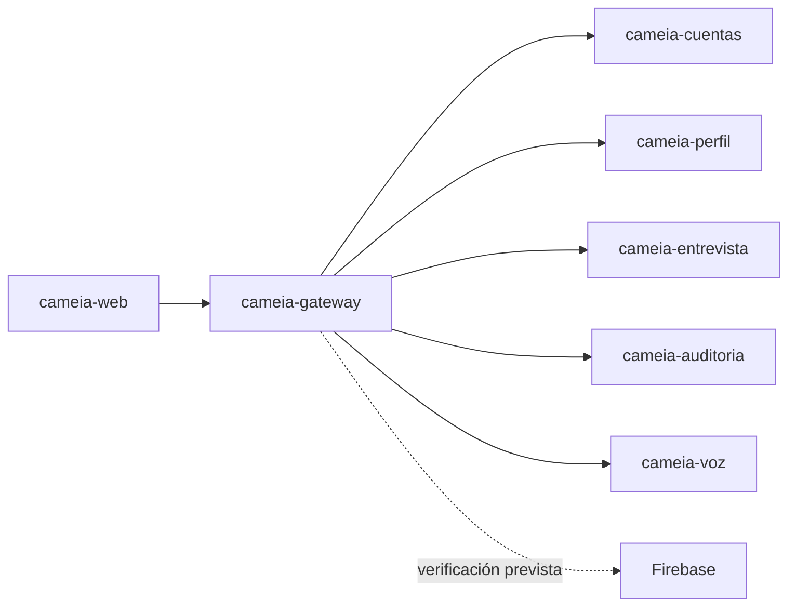

# cameia-gateway

API Gateway de CAMEIA. Proporciona el punto de entrada controlado para la aplicación web y enruta solicitudes hacia los microservicios del MVP.

> **Estado:** CM-104 implementado — base técnica operativa (Spring Cloud Gateway + Firebase auth + Docker). Ver `specs/104-base-tecnica/` para el historial SDD.

## Alcance del Sprint 1

- Crear la estructura técnica y dependencias del Gateway.
- Preparar enrutamiento hacia los servicios realmente incluidos en el incremento.
- Definir controles transversales solo cuando sus contratos y criterios estén aprobados.

No implementa reglas de negocio de Cuentas, Perfil, Entrevista, Auditoría o Voz.

## Responsabilidades

- Recibir las solicitudes de la aplicación web.
- Verificar y propagar identidad/autorización según la decisión de Firebase.
- Enrutar hacia el servicio responsable sin acceder a sus bases de datos.
- Aplicar controles transversales aprobados: validación, CORS, límites o trazabilidad.
- Exponer respuestas y errores consistentes sin revelar información sensible.

## Contexto arquitectónico



## Tecnología

| Elemento | Versión |
|---|---|
| Lenguaje | Java 21 |
| Framework | Spring Boot 4.1.1 / Spring Cloud Gateway (WebFlux) |
| Auth | Firebase Admin SDK |
| Build | Maven (sin instalación local requerida — usar Docker) |
| Ejecución objetivo | Contenedor OCI en Cloud Run |

## Contratos y dependencias

| Dependencia | Header propagado | Notas |
|---|---|---|
| `cameia-web` | — | Consumidor; origen CORS configurable |
| `cameia-cuentas` | `X-User-Id`, `X-User-Plan` | Sprint 1; también recibe `/webhooks/wompi` sin auth |
| `cameia-perfil` | `X-User-Id`, `X-User-Plan` | Sprint 1 |
| `cameia-entrevista` | `X-User-Id`, `X-User-Plan` | Sprint 1 |
| `cameia-voz` | `X-User-Id`, `X-User-Plan` | Sprint 2 (ruta declarada) |
| `cameia-auditoria` | `X-User-Id`, `X-User-Plan` | Sprint 2/3 (ruta declarada) |
| Firebase Auth | — | Verifica ID Token; extrae uid y claim `plan` |

El custom claim en Firebase se llama `plan` (string `"FREE"` | `"PREMIUM"`).
Lo escribe cameia-cuentas al activar una suscripción.

## Ejecución local

**Requisitos:** Docker Desktop. No se necesita JDK ni Maven instalado.

> **Se recomienda firmemente ejecutar el gateway con Docker (`docker compose`) y no desde el IDE o
> con Maven local.** Con Docker, el compose ya entrega al contenedor las variables que necesita el
> emulador de Firebase Auth, con los nombres de red correctos. Fuera de Docker hay que configurarlas
> a mano, y un detalle rompe el arranque:
>
> - `FIREBASE_AUTH_EMULATOR_HOST` debe ser una **variable de entorno del sistema operativo** en la
>   configuración de ejecución. Como propiedad `-D`, argumento `--` o entrada de un YAML, el Admin
>   SDK de Firebase no la ve y el gateway se niega a arrancar (`specs/CM-188-correcciones/`, `REQ-EMC-09`).
> - Su valor debe ser `localhost:9099`, no `cameia-firebase-emulator:9099`: ese nombre solo existe
>   dentro de la red `cameia-net` de Docker.

### 1. Configurar variables de entorno

```bash
cp .env.example .env
# Editar .env con los valores reales (Firebase, URLs de servicios)
```

### 2. Ejecutar los tests

```bash
docker compose run --rm verify
```

### 3. Construir la imagen

```bash
docker build -t cameia-gateway .
```

### 4. Arrancar en local

```bash
docker network create cameia-net   # una sola vez
docker compose up --build -d       # gateway y emulador de Firebase Auth
```

`docker run --env-file .env` no sirve con el emulador: el contenedor queda fuera de `cameia-net` y
no resuelve `cameia-firebase-emulator`.

### 5. Verificar que está vivo

```bash
curl http://localhost:8080/actuator/health
# Respuesta esperada: {"status":"UP"}
```

## Configuración y seguridad

- No guardar secretos, credenciales Firebase ni `.env` en Git.
- Aplicar mínimo privilegio y no propagar datos que el servicio destino no necesite.
- No registrar tokens, CV, transcripciones ni payloads sensibles completos.
- Documentar variables por nombre y propósito en `.env.example` cuando sean aprobadas.

## Calidad esperada

- Pruebas de enrutamiento, errores, autenticación y autorización aplicables.
- Fallos seguros ante token inválido, destino no disponible o timeout.
- Formato, lint, pruebas, build y seguridad en CI cuando existan comandos reales.

## Contribución

- Rama estable: `main`.
- Rama de integración: `develop`.
- Ramas de trabajo: `<tipo>/CM-NNN-<descripcion-kebab-case>`.
- Los cambios ordinarios se integran a `develop` mediante Pull Request.
- La promoción a `main` utiliza un PR independiente.
- El autor no puede ser la única aprobación.

## Cuándo actualizar este README

Actualizarlo en el mismo PR que cambie propósito, stack, comandos, variables, rutas, autenticación, contratos, estructura, pruebas, despliegue o responsables. Si el cambio no requiere actualización, justificarlo en la plantilla del PR.