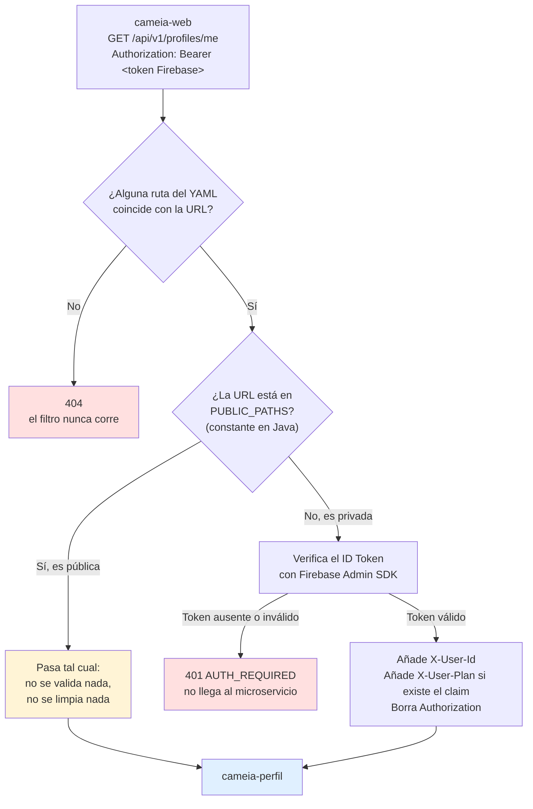
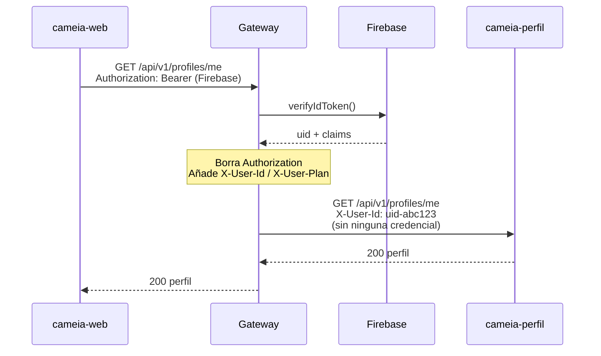
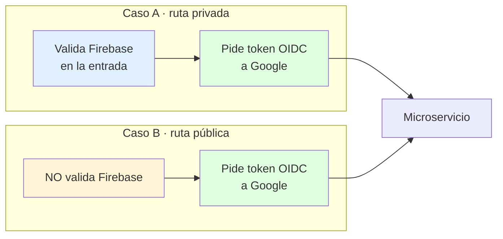
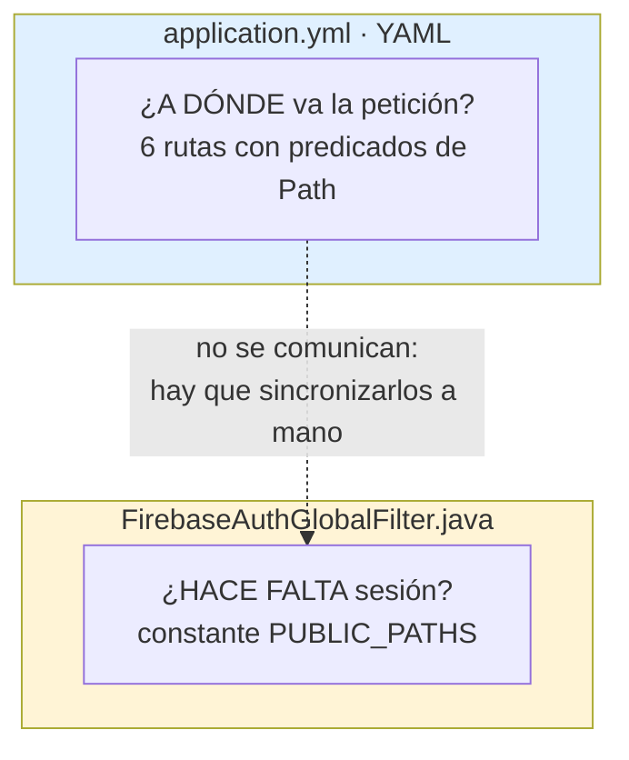
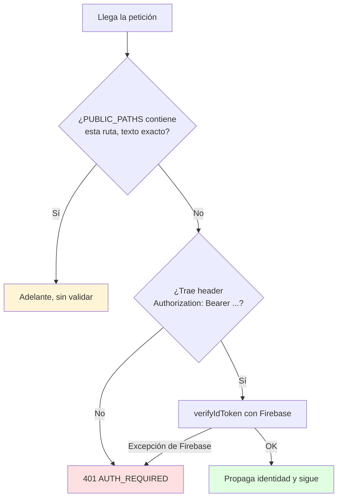

# Cómo funciona el API Gateway (estado real del código)

> **Para personas.** Esto describe lo que el código *hace hoy*, no lo que debería hacer.
> Las reglas que debe seguir quien programa aquí están en [`AGENTS.md`](../AGENTS.md).
>
> Escaneado sobre la rama `CM-104-correcciones`, base `cd5b4c0`.
> Todo lo que se afirma aquí se comprobó leyendo el código o ejecutándolo: suite en verde, 10/10.

---

## Las cuatro respuestas, de un vistazo

| Pregunta | Respuesta corta | Dónde |
|---|---|---|
| ¿Pide a Google un token para cada petición hacia los microservicios? | 🔴 **No. Ni en rutas públicas ni en privadas.** | [§3](#3-pregunta-1--el-token-oidc-de-google) |
| ¿Hay healthcheck o perfil propio en Docker? | 🟡 **Healthcheck sí. Perfil `local`, solo de nombre.** | [§4](#4-pregunta-2--docker-healthcheck-y-perfiles) |
| ¿Cómo sabe si una ruta exige sesión? | 🟡 **Lista blanca fija en Java, no en el YAML.** | [§5](#5-pregunta-3--enrutamiento-y-la-decisión-de-requiere-sesión) |
| ¿Implementa rate limit? | 🔴 **No. Y está fuera de alcance por decisión escrita.** | [§6](#6-pregunta-4--rate-limit) |

Dicho en una frase: **el gateway hoy autentica usuarios y enruta, nada más.** Las dos capas que faltan (token hacia los microservicios y límite de tráfico) no están empezadas.

---

## 1. El mapa del código

Todo el servicio son **5 clases y 249 líneas de Java**. Casi toda la configuración vive en YAML.

```text
tech.cameia.gateway
│
├── GatewayApplication.java ......... 16 líneas  Arranque. Nada más.
│
├── config/
│   ├── FirebaseConfig.java ......... 47 líneas  Enciende el Admin SDK al arrancar
│   └── GatewayProperties.java ...... 35 líneas  ⚠️ Declarada pero inerte: nadie la usa
│
├── filter/
│   └── FirebaseAuthGlobalFilter.java  97 líneas  ⭐ El corazón. Valida token y propaga identidad
│
└── exception/
    └── GlobalErrorHandler.java ..... 54 líneas  Da formato JSON a los errores
```

| Archivo | Qué decide |
|---|---|
| `application.yml` | **A dónde** va cada petición (6 rutas), CORS y timeout |
| `FirebaseAuthGlobalFilter.java` | **Si hace falta** haber iniciado sesión |
| `docker-compose.yml` | Cómo se levanta en local y cómo se corren las pruebas |

> 💡 **La idea clave del diseño:** el *destino* se declara en YAML, pero la *seguridad* se decide en Java. Son dos archivos distintos que hay que mantener sincronizados a mano. Volvemos a esto en [§5](#5-pregunta-3--enrutamiento-y-la-decisión-de-requiere-sesión).

---

## 2. El viaje de una petición

Así se ve hoy una llamada del frontend a un endpoint de perfil:



Y lo mismo en el tiempo, para ver quién habla con quién:



> 🔴 Fíjate en la penúltima flecha: **la petición llega a cameia-perfil sin ninguna credencial.** Cualquiera que alcance la red del microservicio puede llamarlo directamente inventando el header `X-User-Id`. Eso es exactamente lo que el token OIDC debe resolver.

---

## 3. Pregunta 1 — El token OIDC de Google

### Respuesta: no está implementado. En ningún caso.

Busqué en todo el repositorio y **no existe una sola línea** que pida un token a Google para hablar con un microservicio. Lo único que usa credenciales de Google es `FirebaseConfig`, y es para *verificar* tokens de usuarios, no para *firmar* llamadas salientes.

### Una aclaración importante sobre la pregunta

Preguntaste por las rutas que **no** requieren autenticación. El requisito es más amplio: **el token OIDC va en las dos clases de ruta.**



Lo único que distingue al Caso B es que **se salta la validación de Firebase en la entrada**. El paso hacia el microservicio es idéntico en ambos. Son dos capas independientes:

- **Firebase** responde *"¿quién es este usuario?"* → mira al navegador.
- **OIDC** responde *"¿tiene derecho este gateway a llamar a este microservicio?"* → mira a la nube.

Hoy la primera existe a medias y **la segunda no existe**.

### Qué hace hoy el código con el header `Authorization`

| Tipo de ruta | Qué pasa con `Authorization` | Qué recibe el microservicio |
|---|---|---|
| Privada (`/api/v1/**`) | Se **borra** | `X-User-Id`, `X-User-Plan`. Ninguna credencial |
| Pública (`/webhooks/wompi`) | Se **reenvía tal cual** | Lo que el cliente haya mandado, sin tocar |

Las dos filas están mal, por motivos distintos:

1. En la privada, borrar el token de Firebase es correcto. El error es **no poner nada en su lugar**: ahí debería ir el token OIDC.
2. En la pública, el filtro hace `return` antes de tocar nada, así que **el `Authorization` del cliente y cualquier header `X-User-*` que mande pasan intactos** hasta cameia-cuentas.

### Lo que falta para cerrarlo

Un único componente reutilizable, aplicado a todas las rutas salientes:

```java
// No existe todavía. Esto es la forma que tendría.
GoogleCredentials.getApplicationDefault()
    .createScoped(...)            // audience = la URL EXACTA del microservicio destino
```

Tres detalles que suelen costar horas de depuración:

- El `audience` debe ser la URL del destino **exacta**, incluida la barra final. Si no coincide, Cloud Run responde `401` y el mensaje no dice que el problema sea el audience.
- El valor del audience es el mismo que la ruta ya tiene en `uri` en el YAML. No hay que crear una segunda variable de entorno para él, porque entonces hay dos valores que pueden divergir.
- En local no hay IAM ni credenciales de Google, así que el paso se apaga con una variable (`GATEWAY_OIDC_ENABLED=false`) y en despliegue queda forzado a `true`.

El detalle completo del objetivo está en [`AGENTS.md` §6](../AGENTS.md).

---

## 4. Pregunta 2 — Docker: healthcheck y perfiles

### Healthcheck: sí, pero solo en Compose

Existe y está bien configurado, en el servicio `app` de `docker-compose.yml`:

```yaml
healthcheck:
  test: ["CMD-SHELL", "wget -qO- http://localhost:8080/actuator/health || exit 1"]
  interval: 10s      # cada 10 segundos
  timeout: 5s        # falla si tarda más de 5
  retries: 12        # 12 fallos seguidos para marcarlo unhealthy
  start_period: 30s  # 30 segundos de gracia al arrancar (la JVM tarda)
```

⚠️ **El `Dockerfile` no tiene instrucción `HEALTHCHECK`.** La comprobación vive únicamente en Compose, o sea solo en desarrollo local. Quien corra la imagen suelta (`docker run`) o la despliegue fuera de Compose no tiene healthcheck. En Cloud Run no importa demasiado, porque Cloud Run aplica sus propias sondas al puerto, pero conviene saberlo.

### Perfiles de Spring: el perfil `local` es solo una etiqueta

Aquí hay una sorpresa. El perfil se activa en tres sitios:

- `application.yml` → `spring.profiles.active: ${SPRING_PROFILES_ACTIVE:local}`
- `docker-compose.yml` servicio `app` → `SPRING_PROFILES_ACTIVE: local`
- `.env.example` → `SPRING_PROFILES_ACTIVE=local`

**Pero no existe ningún archivo `application-local.yml`.** El único archivo de perfil del repositorio es `src/test/resources/application-test.yml`, que sí hace algo real: apaga Firebase (`gateway.firebase.enabled=false`) para que las pruebas usen un mock.

```text
src/main/resources/
└── application.yml          ← toda la configuración, sin distinguir entorno

src/test/resources/
├── application-test.yml     ← el único perfil con contenido propio
└── firebase-noop.json
```

Consecuencia práctica: **hoy el perfil `local` no cambia nada.** La diferencia entre local y despliegue se hace enteramente con variables de entorno. Funciona, pero significa que no hay dónde poner una regla del tipo "en despliegue esto va forzado a `true`", que es justo lo que pide el flag de OIDC de [§3](#3-pregunta-1--el-token-oidc-de-google).

### Los dos servicios de Compose

| Servicio | Para qué | Imagen |
|---|---|---|
| `app` | El gateway corriendo, puerto 8080 | Se construye del `Dockerfile` |
| `verify` | Compilar y correr las pruebas sin instalar Java ni Maven | `maven:3.9-eclipse-temurin-21` |

⚠️ **`verify` arranca junto con `app`.** El comentario del archivo dice *"No se levanta con `up`: se invoca a demanda"*, pero nada en el archivo implementa eso. Lo comprobé:

```console
$ docker compose config --services
app
verify

$ docker compose config --profiles
(vacío)
```

Como `verify` no está detrás de un perfil de Compose, `docker compose up` lo levanta también y se queda corriendo la suite de pruebas. Para que el comentario sea verdad hace falta añadirle `profiles: ["tools"]` y llamarlo con `docker compose run --rm verify`, que es como ya lo documentan el README y `AGENTS.md`.

### Dos notas sobre la imagen

- El contenedor **corre como `root`**: el `Dockerfile` no crea usuario ni tiene instrucción `USER`.
- La clave de Firebase se monta como volumen de solo lectura y **nunca se copia a la imagen**, que es lo correcto. Si `FIREBASE_KEY_PATH` está vacío, Compose monta `/dev/null` y el gateway no arranca. Es fallo intencional, no un bug.

---

## 5. Pregunta 3 — Enrutamiento y la decisión de "¿requiere sesión?"

Esta es la parte con más matices, así que la separo en dos preguntas, porque **son dos mecanismos distintos que no se conocen entre sí**.



### 5.1 ¿A dónde va? — lo decide el YAML

Cada ruta son tres cosas: un `id`, un destino (`uri`, siempre una variable de entorno) y uno o más `predicates` que deciden si la URL encaja.

```yaml
- id: cameia-perfil
  uri: ${CAMEIA_PERFIL_URL}        # a dónde
  predicates:
    - Path=/api/v1/profiles/**     # qué URLs entran aquí
```

Las 6 rutas declaradas hoy:

| URL que llega | Va a | Predicados |
|---|---|---|
| `/api/v1/users/**` | cameia-cuentas | `Path` |
| `/api/v1/profiles/**` | cameia-perfil | `Path` |
| `/api/v1/interviews/**` | cameia-entrevista | `Path` |
| `/webhooks/wompi` | cameia-cuentas | `Path` + `Method=POST` |
| `/api/v1/voice-service/**` | cameia-voz | `Path` |
| `/api/v1/audit/**` | cameia-auditoria | `Path` |

Ninguna URL se escribe en Java. Si ninguna ruta coincide, la respuesta es `404`.

### 5.2 ¿Hace falta sesión? — lo decide una constante en Java

Aquí está la respuesta a tu pregunta. **No hay ninguna marca en el YAML que diga si una ruta es pública o privada.** La decisión la toma un único filtro global que corre para *todas* las rutas, y que consulta una lista fija escrita en el código:

```java
private static final Set<String> PUBLIC_PATHS = Set.of(
        "/webhooks/wompi",
        "/actuator/health",
        "/actuator/info"
);
```

La regla es **"todo cerrado salvo lo listado"**, que es la orientación segura: si alguien añade una ruta nueva al YAML y no toca el Java, esa ruta queda protegida por omisión. Nunca se abre sola.



### 5.3 Cuatro consecuencias de que la lista esté en Java

Esto es lo que conviene entender antes de añadir rutas:

**1. Abrir una ruta al público exige recompilar.**
`AGENTS.md` §5 dice que añadir una ruta *"no requiere código Java, solo editar `application.yml`"*. Es cierto solo si la ruta es privada. Si es pública, hay que editar la constante, recompilar y volver a construir la imagen.

**2. La comparación es de texto exacto, sin comodines.**
`PUBLIC_PATHS` es un `Set<String>` y se consulta con `.contains(path)`. No admite patrones. Por eso:

| URL | ¿Pasa como pública? |
|---|---|
| `/webhooks/wompi` | ✅ Sí |
| `/webhooks/wompi/` | ❌ No, con barra final pide token |
| `/webhooks/wompi/callback` | ❌ No |

No se puede expresar una familia pública tipo `/api/v1/public/**` sin cambiar la forma de comparar.

**3. El filtro ignora el método HTTP.**
`PUBLIC_PATHS` solo mira la ruta. Que `/webhooks/wompi` sea POST lo impone el predicado `Method=POST` del YAML, no el filtro. Un `GET /webhooks/wompi` no coincide con ninguna ruta y muere en un `404` antes de llegar al filtro.

**4. Las dos entradas de Actuator no hacen nada.**
Esto lo comprobé experimentalmente: quité `/actuator/health` y `/actuator/info` de `PUBLIC_PATHS`, corrí la suite, y la prueba que pide `/actuator/health` sin token **siguió dando 200**. El motivo es el orden interno de Spring: los endpoints de Actuator los atiende su propio handler, que tiene más prioridad que el enrutador del gateway, así que el filtro **nunca llega a verlos**. Son entradas defensivas e inertes. No molestan, pero no protegen ni desprotegen nada.

### 5.4 Lo que sí se aplica a todas las rutas

| Control | Valor | Dónde |
|---|---|---|
| CORS | Un solo origen (`GATEWAY_CORS_ALLOWED_ORIGIN`), con credenciales, cacheado 1 h | `globalcors` en el YAML |
| Timeout al microservicio | 30 s (`GATEWAY_TIMEOUT_MS`) | `httpclient.response-timeout` |
| Formato de error | `{"code":"...","message":"..."}` | `GlobalErrorHandler` |

⚠️ Dos avisos sobre esta tabla:

- La lista de headers permitidos por CORS **incluye `X-User-Id` y `X-User-Plan`**. Son justo los headers que solo el gateway debería emitir, y permitirlos en CORS invita al navegador a mandarlos.
- El manejador de errores solo conserva el código de estado si la excepción es una `ResponseStatusException`. **Todo lo demás se convierte en `500`** y el mensaje de la excepción se copia al cuerpo de la respuesta. No hay ninguna prueba que cubra "microservicio caído" ni "microservicio lento", así que el `504` que promete el requisito REQ-NF-02 no está verificado en este repositorio.

---

## 6. Pregunta 4 — Rate limit

### Respuesta: no hay nada. Y es una decisión, no un olvido.

Busqué todos los mecanismos habituales y no aparece ninguno:

| Qué busqué | Resultado |
|---|---|
| Filtro `RequestRateLimiter` de Spring Cloud Gateway | No está |
| Redis (`spring-boot-starter-data-redis-reactive`) | No está |
| Un bean `KeyResolver` (define *por quién* se cuenta) | No está |
| `bucket4j`, `resilience4j` | No están |
| Circuit breaker, reintentos | No están |

**Hoy el gateway reenvía tantas peticiones como reciba.** El único control de tráfico es el timeout de 30 segundos por petición.

Y es deliberado: la spec de CM-113 lo dice en su sección *Fuera de alcance*, junto al circuit breaker y a mTLS.

### Si se decide implementarlo

Dos piezas y una advertencia:

1. El filtro `RequestRateLimiter`, que en Spring Cloud Gateway usa Redis con algoritmo *token bucket*.
2. Un `KeyResolver`, que responde *"¿por quién cuento las peticiones?"*. Lo natural aquí es por `X-User-Id` en rutas privadas y por IP en las públicas.

⚠️ **La advertencia:** en Cloud Run el gateway escala a varias instancias. Un contador en memoria limita por instancia, así que con 4 instancias el límite real es 4 veces el configurado. Por eso el contador tiene que ser compartido (Redis) o el límite tiene que aplicarse antes del gateway (Cloud Armor).

---

## 7. Otros hallazgos del escaneo

Cosas que no preguntaste pero que salieron al leer el código. Están en la tabla de brechas de [`AGENTS.md` §6.5](../AGENTS.md) con su ubicación exacta.

| # | Hallazgo | Por qué importa |
|---|---|---|
| 1 | El filtro **añade** los headers `X-User-*` en vez de reemplazarlos | Si el cliente manda su propio `X-User-Id`, el microservicio recibe **dos valores** y elige uno |
| 2 | En rutas públicas no se limpia ningún header de identidad | Un cliente puede inventarse `X-User-Id` hacia `/webhooks/wompi` |
| 3 | Un `Bearer` vacío produce `500`, no `401` | `verifyIdToken("")` lanza `IllegalArgumentException`, y el filtro solo captura `FirebaseAuthException` |
| 4 | El cuerpo del error copia el mensaje de la excepción | Puede filtrar detalle interno, como nombres de host, al cliente |
| 5 | `GatewayProperties` está declarada, validada y sin usar | Parece que la configuración se valida al arrancar, y no es así: el YAML lee las variables de entorno directamente |
| 6 | Faltan `X-User-Email`, `X-User-Roles` y `X-Request-Id` | cameia-cuentas y cameia-entrevista los declaran obligatorios en su contrato de entrada |
| 7 | Sin `X-Request-Id`, no hay trazabilidad entre servicios | Un error reportado por el frontend no se puede seguir por los logs de los microservicios |

---

## 8. Cómo comprobar todo esto tú mismo

Con Docker, sin instalar Java ni Maven:

```bash
docker network create cameia-net        # una sola vez
docker compose run --rm verify          # compila y corre las 10 pruebas
docker compose up --build -d app        # levanta el gateway (nombra 'app' para no arrancar 'verify')
curl http://localhost:8080/actuator/health
```

Las comprobaciones puntuales de este documento:

```bash
# ¿Hay firma OIDC de las llamadas salientes? (sin resultados = no hay nada)
grep -rn "targetAudience\|IdTokenCredentials\|IdTokenProvider" src/

# ¿Quién usa credenciales de Google? (1 resultado: FirebaseConfig, y es para
# verificar tokens de usuarios con el Admin SDK, no para firmar llamadas salientes)
grep -rn "getApplicationDefault" src/

# ¿Hay rate limit? (sin resultados = no hay nada)
grep -rni "ratelimit\|redis\|KeyResolver" src/ pom.xml

# ¿Qué servicios arranca 'up'?
docker compose config --services

# ¿Qué rutas están declaradas?
grep -A2 "id:" src/main/resources/application.yml
```

---

## Resumen para quien tenga que priorizar

Lo que hay hoy funciona para el objetivo de CM-113: el frontend puede llamar al gateway con un token de Firebase y llegar a cameia-perfil. Sobre eso:

- 🔴 **Bloqueante para despliegue:** sin token OIDC, cualquiera con acceso a la red del microservicio puede llamarlo saltándose el gateway e inventando la identidad. Es la brecha más grande.
- 🟠 **Barato y de alto valor:** reemplazar en vez de añadir los headers `X-User-*`, limpiarlos en rutas públicas, y devolver `401` en lugar de `500` con un `Bearer` vacío. Son pocas líneas cada uno.
- 🟡 **Antes de que crezca:** `X-Request-Id` para trazabilidad, y el perfil de despliegue como archivo propio para poder forzar valores que el entorno no pueda apagar.
- ⚪ **Cuando toque, no ahora:** rate limit, circuit breaker. Están fuera de alcance por escrito y necesitan Redis o Cloud Armor para funcionar de verdad con varias instancias.
