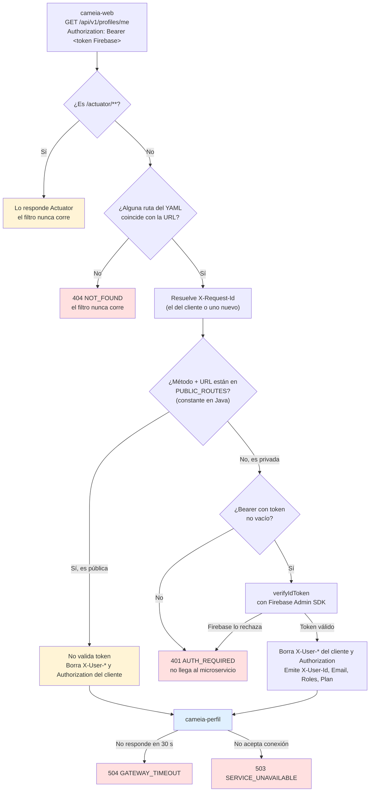
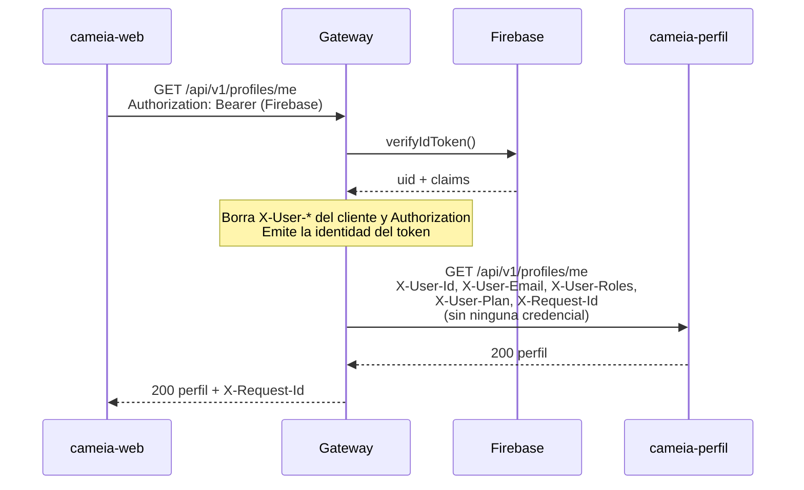
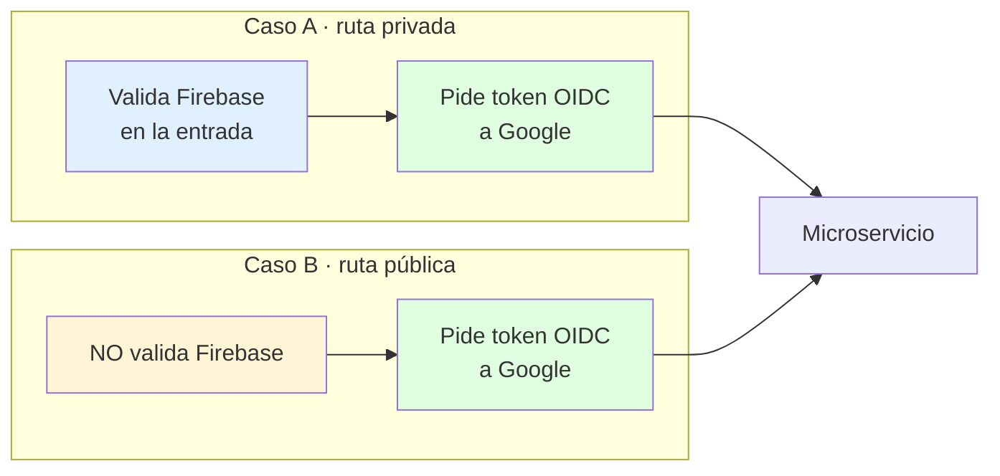
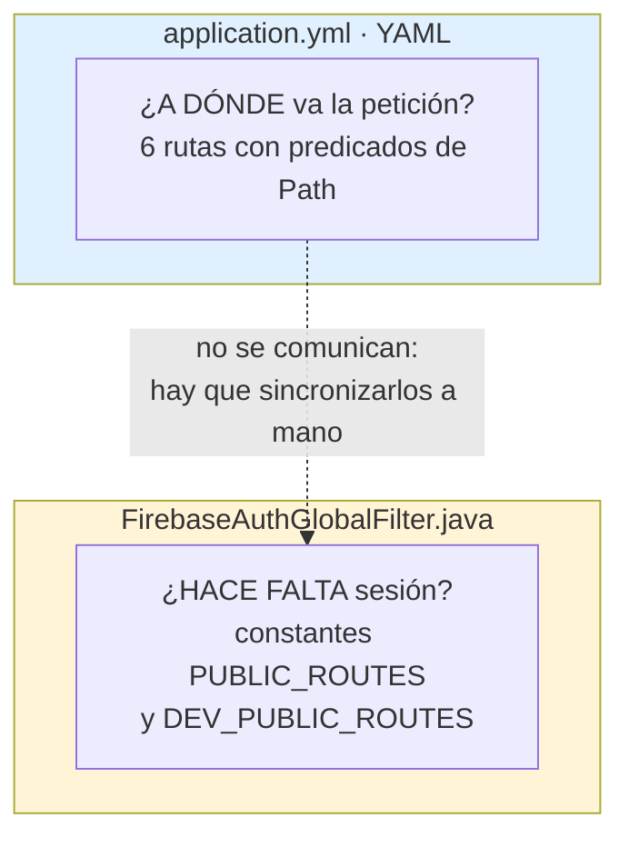
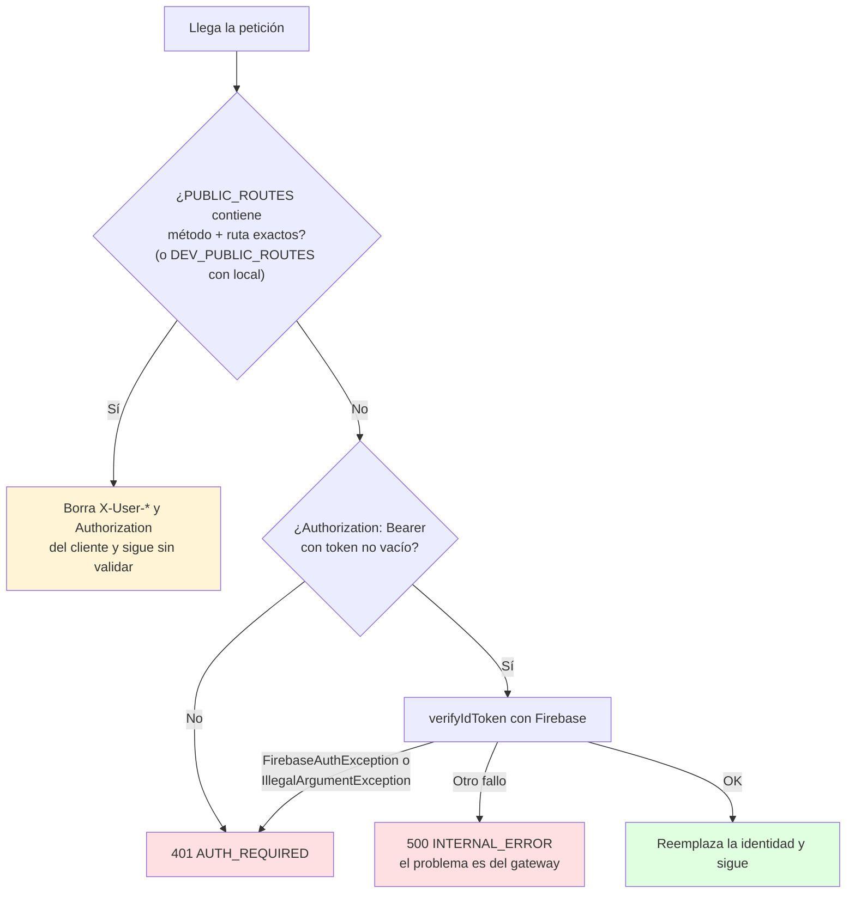

# Cómo funciona el API Gateway (estado real del código)

> **Para personas.** Esto describe lo que el código *hace hoy*, no lo que debería hacer.
> Las reglas que debe seguir quien programa aquí están en [`AGENTS.md`](../AGENTS.md).
>
> Actualizado el 14/09/2026 tras `CM-104-correcciones`, rama `CM-104-correcciones-bloque-3`, base `c0f834e`.
> Todo lo que se afirma aquí se comprobó leyendo el código o ejecutándolo: suite en verde, 27/27.
> El escaneo original (11/09/2026, base `cd5b4c0`) encontró los defectos que corrigió ese spec;
> este documento ya no los describe como vigentes.

---

## Las cuatro respuestas, de un vistazo

| Pregunta | Respuesta corta | Dónde |
|---|---|---|
| ¿Pide a Google un token para cada petición hacia los microservicios? | 🟡 **Sí, en las dos clases de ruta, con el flag encendido.** Implementado y probado; falta verificarlo desplegado | [§3](#3-pregunta-1--el-token-oidc-de-google) |
| ¿Hay healthcheck o perfil propio en Docker? | 🟢 **Sí a los dos.** Healthcheck en la imagen y en Compose; perfil `local` con archivo propio | [§4](#4-pregunta-2--docker-healthcheck-y-perfiles) |
| ¿Cómo sabe si una ruta exige sesión? | 🟡 **Lista blanca fija en Java, no en el YAML.** | [§5](#5-pregunta-3--enrutamiento-y-la-decisión-de-requiere-sesión) |
| ¿Implementa rate limit? | 🔴 **No. Y está fuera de alcance por decisión escrita.** | [§6](#6-pregunta-4--rate-limit) |

Dicho en una frase: **el gateway autentica usuarios, sanea y propaga su identidad, traza cada petición y
traduce los fallos del microservicio a errores honestos.** Firma las llamadas salientes con OIDC, pendiente de
verificarse en Cloud Run. Falta el límite de tráfico.

---

## 1. El mapa del código

El servicio son **9 clases de Java**, buena parte Javadoc. Casi toda la configuración
vive en YAML.

```text
tech.cameia.gateway
│
├── GatewayApplication.java ......... 12 líneas  Arranque. Nada más.
│
├── config/
│   ├── FirebaseConfig.java ......... Enciende el Admin SDK al arrancar
│   ├── OidcConfig.java ............. Crea la firma OIDC solo si el flag está encendido
│   └── OidcRequiredInProd.java ..... Con perfil prod, no arranca sin firma
│
├── filter/
│   ├── FirebaseAuthGlobalFilter.java ⭐ El corazón. Token, identidad y X-Request-Id
│   ├── OidcSigningGlobalFilter.java  Firma cada llamada saliente
│   ├── OidcTokenSource.java ........ Interfaz: token para un audience
│   └── GoogleIdTokenSource.java .... La implementación que habla con Google
│
└── exception/
    └── GlobalErrorHandler.java .... 163 líneas  Catálogo cerrado de errores
```

| Archivo | Qué decide |
|---|---|
| `application.yml` | **A dónde** va cada petición (6 rutas), CORS, timeout y qué expone Actuator |
| `application-local.yml` | Lo que cambia en el perfil `local`: hoy, solo el log de coincidencia de rutas |
| `FirebaseAuthGlobalFilter.java` | **Si hace falta** haber iniciado sesión, qué identidad recibe el microservicio y el `X-Request-Id` |
| `GlobalErrorHandler.java` | Qué estado y qué cuerpo recibe el cliente cuando algo falla |
| `docker-compose.yml` | Cómo se levanta en local y cómo se corren las pruebas |

> 💡 **La idea clave del diseño:** el *destino* se declara en YAML, pero la *seguridad* se decide en Java.
> Son dos archivos distintos que hay que mantener sincronizados a mano. Volvemos a esto en
> [§5](#5-pregunta-3--enrutamiento-y-la-decisión-de-requiere-sesión).

---

## 2. El viaje de una petición

Así se ve hoy una llamada del frontend a un endpoint de perfil:



Y lo mismo en el tiempo, para ver quién habla con quién:



> 🔴 Fíjate en la penúltima flecha hacia el microservicio: **la petición llega a cameia-perfil sin ninguna
> credencial.** El gateway ya no deja pasar identidades inventadas por el cliente, pero cualquiera que
> alcance la red del microservicio puede llamarlo directamente, saltándose el gateway, e inventar el
> header `X-User-Id`. Eso es exactamente lo que el token OIDC debe resolver.

---

## 3. Pregunta 1 — El token OIDC de Google

### Respuesta: implementado y probado, pendiente de verificar desplegado

`OidcSigningGlobalFilter` pide a Google un token para el microservicio destino y lo pone en `Authorization`.
Corre en las dos clases de ruta. Spec: [`specs/CM-104-correcciones-OIDC/`](../specs/CM-104-correcciones-OIDC/).
La suite lo prueba con una fuente de tokens falsa; que Cloud Run lo acepte solo se comprueba al desplegar
(Bloque 0 de esa spec: service account, `run.invoker` y URLs `*.run.app`).

### Una aclaración importante sobre la pregunta

El token OIDC no es solo para las rutas que no requieren autenticación: **va en las dos clases de ruta.**



Lo único que distingue al Caso B es que **se salta la validación de Firebase en la entrada**. El paso hacia
el microservicio es idéntico en ambos. Son dos capas independientes:

- **Firebase** responde *"¿quién es este usuario?"* → mira al navegador.
- **OIDC** responde *"¿tiene derecho este gateway a llamar a este microservicio?"* → mira a la nube.

### Qué recibe hoy el microservicio

| Tipo de ruta | `Authorization` | Cabeceras de identidad | Trazabilidad |
|---|---|---|---|
| Privada (`/api/v1/**`) | El del cliente se **borra**; con la firma encendida lleva **solo** el token OIDC | Las del token: `X-User-Id` siempre; `X-User-Email`, `X-User-Roles` y `X-User-Plan` si el claim existe. Las del cliente se descartan | `X-Request-Id` |
| Pública (`POST /webhooks/wompi`, `POST /api/v1/users`) | Igual que la privada | Ninguna: las `X-User-*` del cliente se borran | `X-Request-Id` |

Hasta CM-14 la ruta pública reenviaba el `Authorization` del cliente. Con el registro abierto se borra: un ID
Token que el navegador mande por inercia no debe llegar a cameia-cuentas (`AGENTS.md` §7, bloqueante 4). Wompi
no lo necesita, porque autentica su webhook con una firma en el cuerpo.

### Cómo funciona

Un único `GlobalFilter` para todas las rutas, en orden `LOWEST_PRECEDENCE - 2`: después de que
`FirebaseAuthGlobalFilter` sanee la identidad y antes del reenvío (`NettyRoutingFilter`, `LOWEST_PRECEDENCE`,
verificado en el jar 5.0.3).

Detalles que suelen costar horas de depuración, y cómo quedaron resueltos:

- **El audience sale de la `uri` de la ruta**, reconstruido como `esquema://host[:puerto]`: sin path, sin barra
  final y **sin el puerto por defecto**. `Route` de Spring Cloud Gateway convierte `https://x.run.app` en
  `https://x.run.app:443`; sin quitarlo, Cloud Run respondería `401` sin decir que el problema es el audience.
  Lo cubre `OidcSigningGlobalFilterUnitTest`.
- **No hay variable de audience**: es el mismo `CAMEIA_*_URL` de la ruta.
- **Fail closed**: si no hay token, `503 SERVICE_UNAVAILABLE` y la petición no sale. El `onErrorResume` solo
  cubre la obtención del token; un timeout del microservicio sigue saliendo como `504`.
- **El flag**: `GATEWAY_OIDC_ENABLED` alimenta `gateway.oidc.signing-enabled`, que vale `false` en local. El
  perfil `prod` lo fija en `true` literal, y `OidcRequiredInProd` impide arrancar `prod` sin firma.

El detalle completo del objetivo está en [`AGENTS.md` §6](../AGENTS.md).

---

## 4. Pregunta 2 — Docker: healthcheck y perfiles

### Healthcheck: en la imagen y en Compose

El `Dockerfile` declara su propia comprobación, así que la tiene también quien corra la imagen suelta con
`docker run`. Compose usa el mismo comando y los mismos intervalos:

```dockerfile
HEALTHCHECK --interval=10s --timeout=5s --start-period=30s --retries=12 \
  CMD wget -qO- http://localhost:8080/actuator/health || exit 1
```

Comprobado: la imagen arrancada con `docker run`, sin Compose, llega a `(healthy)`. En Cloud Run esta
instrucción no se usa, porque Cloud Run aplica sus propias sondas al puerto.

### Perfiles de Spring

El perfil `local` **ya no es el activo por defecto** (CM-14, `GW-TBD-19`): abre rutas públicas de
desarrollo y no debe activarse solo. Se declara en dos sitios:

- `docker-compose.yml` servicio `app` → `SPRING_PROFILES_ACTIVE: local`
- `.env.example` → `SPRING_PROFILES_ACTIVE=local`

`application.yml` queda con `spring.profiles.active: ${SPRING_PROFILES_ACTIVE:}`. Comprobado: sin la
variable, el log dice `No active profile set, falling back to 1 default profile: "default"` y el contexto
arranca. Si `local` está activo y existe `K_SERVICE` (Cloud Run la inyecta), el Gateway no arranca.

El perfil `prod` (`application-prod.yml`) es el de despliegue: fija la firma OIDC en `true` y baja el log de
rutas a `WARN`. **Los workflows todavía no lo activan**: hay que añadir `SPRING_PROFILES_ACTIVE=prod` a sus
`--set-env-vars`. `local` y `prod` no pueden arrancar juntos.

`local` tiene archivo propio, `src/main/resources/application-local.yml`, con un único ajuste de desarrollo:

```yaml
logging:
  level:
    org.springframework.cloud.gateway: DEBUG   # traza de coincidencia de rutas
```

Comprobado: al arrancar con Compose el log dice `The following 1 profile is active: "local"` y aparecen las
trazas `DEBUG` de coincidencia de rutas, que `application.yml` deja en `INFO`.

> El archivo está versionado y **no debe contener secretos**. Hasta el 14/09/2026 `.gitignore` lo ignoraba,
> y por eso el que marcaba como creado CM-104 nunca llegó al repositorio.

```text
src/main/resources/
├── application.yml          ← rutas, CORS, timeout, Actuator
└── application-local.yml    ← solo overrides de desarrollo

src/test/resources/
├── application-test.yml     ← apaga Firebase (gateway.firebase.enabled=false) para usar un mock
└── firebase-noop.json
```

La diferencia entre local y despliegue se sigue haciendo con variables de entorno. El perfil de despliegue
como archivo propio lo crea el spec de OIDC, que lo necesita para forzar `GATEWAY_OIDC_ENABLED=true`.

### Los dos servicios de Compose

| Servicio | Para qué | Cómo se arranca |
|---|---|---|
| `app` | El gateway corriendo, puerto 8080 | `docker compose up --build -d` |
| `verify` | Compilar y correr las pruebas sin instalar Java ni Maven | `docker compose run --rm verify` |

`verify` está detrás del perfil de Compose `tools`, así que `up` ya no lo arranca:

```console
$ docker compose config --services
app

$ docker compose --profile tools config --services
verify
app
```

`docker compose run --rm verify` sigue funcionando igual, porque `run` activa el perfil del servicio que nombra.

### Notas sobre la imagen y las credenciales

- El contenedor corre con el usuario **`cameia`**, sin privilegios. Comprobado: `docker exec … whoami` responde `cameia`.
- En local, la clave de Firebase se monta como volumen de solo lectura en `/run/secrets/firebase-key` y
  **nunca se copia a la imagen**. Si `FIREBASE_KEY_PATH` está vacío en `.env`, Compose monta `/dev/null` y el
  gateway no arranca: es un fallo intencional, no un bug.
- En Cloud Run no se monta ningún JSON. Los workflows de `.github/workflows/` despliegan con
  `--service-account` y sin `GOOGLE_APPLICATION_CREDENTIALS`, así que el Admin SDK toma las credenciales de la
  cuenta de servicio del servicio. Desde #39 es una cuenta dedicada, `cameia-gateway-run`, y no la de Compute
  Engine por defecto. Esa misma identidad es la que firma los tokens OIDC.

---

## 5. Pregunta 3 — Enrutamiento y la decisión de "¿requiere sesión?"

Esta es la parte con más matices, así que la separo en dos preguntas, porque **son dos mecanismos distintos
que no se conocen entre sí**.



### 5.1 ¿A dónde va? — lo decide el YAML

Cada ruta son tres cosas: un `id`, un destino (`uri`, siempre una variable de entorno) y uno o más
`predicates` que deciden si la URL encaja.

```yaml
- id: cameia-perfil
  uri: ${CAMEIA_PERFIL_URL}        # a dónde
  predicates:
    - Path=/api/v1/profiles/**     # qué URLs entran aquí
```

Las 6 rutas declaradas hoy:

| URL que llega | Va a | Predicados |
|---|---|---|
| `/api/v1/users/**` | cameia-cuentas | `Path` |
| `/api/v1/profiles/**` | cameia-perfil | `Path` |
| `/api/v1/interviews/**` | cameia-entrevista | `Path` |
| `/webhooks/wompi` | cameia-cuentas | `Path` + `Method=POST` |
| `/api/v1/voice-service/**` | cameia-voz | `Path` |
| `/api/v1/audit/**` | cameia-auditoria | `Path` |

Ninguna URL se escribe en Java. Si ninguna ruta coincide, la respuesta es `404 NOT_FOUND`.

### 5.2 ¿Hace falta sesión? — lo decide una constante en Java

**No hay ninguna marca en el YAML que diga si una ruta es pública o privada.** La decisión la toma un único
filtro global que corre para *todas* las rutas del gateway, y que consulta listas fijas escritas en el código.
Cada entrada es un método y una ruta (CM-14):

```java
private record PublicRoute(HttpMethod method, String path) { }

private static final Set<PublicRoute> PUBLIC_ROUTES = Set.of(
        new PublicRoute(HttpMethod.POST, "/webhooks/wompi"),
        new PublicRoute(HttpMethod.POST, "/api/v1/users")
);

// Solo se consulta con el perfil local activo
private static final Set<PublicRoute> DEV_PUBLIC_ROUTES = Set.of(
        new PublicRoute(HttpMethod.GET, "/api/v1/users/health"),
        // ... profiles, interviews, voice-service, audit
);
```

La regla es **"todo cerrado salvo lo listado"**, que es la orientación segura: si alguien añade una ruta nueva
al YAML y no toca el Java, esa ruta queda protegida por omisión. Nunca se abre sola.



Un token vacío (`Authorization: Bearer `) se rechaza **antes** de llamar a Firebase. Un fallo que no es culpa
del token, como no poder hablar con Firebase, no se disfraza de `401`.

### 5.3 Cuatro consecuencias de que la lista esté en Java

Esto es lo que conviene entender antes de añadir rutas:

**1. Abrir una ruta al público exige recompilar.**
Una ruta privada solo necesita el YAML. Una pública exige además editar `PUBLIC_ROUTES`, recompilar y volver a
construir la imagen. `AGENTS.md` §5 ya lo documenta.

**2. La comparación es de texto exacto, sin comodines.**
`PUBLIC_ROUTES` es un `Set<PublicRoute>` y se consulta con `.contains(new PublicRoute(método, ruta))`. No
admite patrones. Por eso:

| Petición | ¿Pasa como pública? |
|---|---|
| `POST /webhooks/wompi` | ✅ Sí |
| `POST /webhooks/wompi/` | ❌ No, con barra final pide token |
| `POST /webhooks/wompi/callback` | ❌ No |
| `GET /api/v1/users/health/` (con `local`) | ❌ No, con barra final pide token |

No se puede expresar una familia pública tipo `/api/v1/public/**` sin cambiar la forma de comparar.

**3. El filtro compara también el método HTTP** (CM-14 REQ-REG-06).
`POST /api/v1/users` es público para el registro, pero `GET`, `PUT`, `PATCH` y `DELETE /api/v1/users` siguen
exigiendo token. En `/webhooks/wompi` el predicado `Method=POST` del YAML ya filtraba antes: un `GET` muere en
`404` sin llegar al filtro.

**4. Actuator no pasa por el filtro, así que no está en la lista.**
Spring elige quién atiende una petición recorriendo sus `HandlerMapping` por orden. Actuator va primero
(orden `-100`) y las rutas del gateway después (orden `1`), así que el filtro **nunca ve** `/actuator/**`.
Comprobado con una prueba de sondeo: `GET /actuator/health` con un token basura responde `200` y Firebase no
llega a llamarse. Por eso las entradas de Actuator se retiraron de la lista pública: no controlaban nada.

La consecuencia importante: **todo endpoint que Actuator exponga es público.** Hoy son `health` e `info`, pero
la lista sale de `MANAGEMENT_ENDPOINTS_WEB_EXPOSURE_INCLUDE`. Con `env` añadido a esa variable,
`/actuator/env` respondió `200` sin token, con perfiles y nombres de propiedades (valores ocultos). Queda
abierto como `GW-TBD-11`.

### 5.4 Lo que se aplica a todas las rutas

| Control | Valor | Dónde |
|---|---|---|
| CORS | Un solo origen (`GATEWAY_CORS_ALLOWED_ORIGIN`), con credenciales, cacheado 1 h. Cabeceras admitidas: `Authorization`, `Content-Type`, `X-Request-Id` | `globalcors` en el YAML |
| Timeout al microservicio | 30 s (`GATEWAY_TIMEOUT_MS`); al agotarse, `504` | `httpclient.response-timeout` |
| `X-Request-Id` | Se conserva el del cliente o se genera uno. Llega al microservicio y vuelve al cliente con un único valor | `FirebaseAuthGlobalFilter` |
| Formato de error | `{"code":"...","message":"..."}` desde un catálogo cerrado | `GlobalErrorHandler` |

CORS ya no admite ninguna cabecera `X-User-*`. Comprobado con el gateway corriendo: un preflight que pide
`X-User-Id` recibe `403`; uno que pide `X-Request-Id` recibe `200`.

El catálogo de errores (spec `CM-104-correcciones` §2.4):

| Situación | Estado | `code` | Quién lo escribe |
|---|---|---|---|
| Token ausente, vacío, malformado o rechazado | `401` | `AUTH_REQUIRED` | el filtro |
| Ninguna ruta coincide con la URL | `404` | `NOT_FOUND` | `GlobalErrorHandler` |
| Respuesta ininteligible del destino | `502` | `BAD_GATEWAY` | `GlobalErrorHandler` |
| Destino inalcanzable | `503` | `SERVICE_UNAVAILABLE` | `GlobalErrorHandler` |
| Destino sin responder a tiempo | `504` | `GATEWAY_TIMEOUT` | `GlobalErrorHandler` |
| Cualquier otro fallo del gateway | `500` | `INTERNAL_ERROR` | `GlobalErrorHandler` |

El mensaje es siempre un texto fijo en español. **El mensaje de la excepción nunca llega al cuerpo**: va al log
en nivel `ERROR`, con el mismo `X-Request-Id` que recibió el microservicio. `GatewayErrorMappingTest` lo
comprueba con un destino lento (`504`), uno inalcanzable (`503`) y buscando `Exception`, `java.` y el host en
los cuerpos.

⚠️ Tres avisos sobre esta sección:

- Un estado que no está en el catálogo conserva su código pero sale con cuerpo `INTERNAL_ERROR`. Ejemplo real:
  `POST /actuator/health` responde `405` con `{"code":"INTERNAL_ERROR"}`. Abierto como `GW-TBD-10`.
- Todo error pasa por el log en `ERROR` con traza completa, incluidos los `404` de URLs inexistentes. Un
  escáner de URLs llena el log.
- CORS no declara `exposedHeaders`, así que el JavaScript del navegador **no puede leer** el `X-Request-Id`
  de la respuesta, aunque llegue.

---

## 6. Pregunta 4 — Rate limit

### Respuesta: no hay nada. Y es una decisión, no un olvido.

Busqué todos los mecanismos habituales y no aparece ninguno:

| Qué busqué | Resultado |
|---|---|
| Filtro `RequestRateLimiter` de Spring Cloud Gateway | No está |
| Redis (`spring-boot-starter-data-redis-reactive`) | No está |
| Un bean `KeyResolver` (define *por quién* se cuenta) | No está |
| `bucket4j`, `resilience4j` | No están |
| Circuit breaker, reintentos | No están |

**Hoy el gateway reenvía tantas peticiones como reciba.** El único control de tráfico es el timeout de 30
segundos por petición.

Y es deliberado: la spec de CM-113 lo dice en su sección *Fuera de alcance*, junto al circuit breaker y a mTLS.

### Si se decide implementarlo

Dos piezas y una advertencia:

1. El filtro `RequestRateLimiter`, que en Spring Cloud Gateway usa Redis con algoritmo *token bucket*.
2. Un `KeyResolver`, que responde *"¿por quién cuento las peticiones?"*. Lo natural aquí es por `X-User-Id` en
   rutas privadas y por IP en las públicas.

⚠️ **La advertencia:** en Cloud Run el gateway escala a varias instancias. Un contador en memoria limita por
instancia, así que con 4 instancias el límite real es 4 veces el configurado. Por eso el contador tiene que
ser compartido (Redis) o el límite tiene que aplicarse antes del gateway (Cloud Armor).

---

## 7. Hallazgos abiertos

Los siete hallazgos del escaneo del 11/09/2026 (identidad añadida en vez de reemplazada, rutas públicas sin
limpiar, `500` ante un Bearer vacío, mensaje de la excepción en el cuerpo, `GatewayProperties` inerte, contrato
de cabeceras incompleto y falta de `X-Request-Id`) quedaron **corregidos y cubiertos por pruebas** en
[`specs/CM-104-correcciones/`](../specs/CM-104-correcciones/).

Lo que sigue abierto hoy:

| # | Hallazgo | Por qué importa | Dónde se sigue |
|---|---|---|---|
| 1 | La firma OIDC no está verificada en Cloud Run, y los workflows no activan el perfil `prod` | Sin `prod` la firma queda apagada en despliegue; sin `run.invoker` el destino responde `403` | Bloque 0 de `specs/CM-104-correcciones-OIDC/` |
| 2 | Todo endpoint expuesto de Actuator es público, y la lista la controla una variable de entorno | Configurarla mal publica endpoints internos sin autenticación | `GW-TBD-11` |
| 3 | Estados fuera del catálogo salen con cuerpo `INTERNAL_ERROR` | El cuerpo contradice al estado (`405` → `INTERNAL_ERROR`) | `GW-TBD-10` |
| 4 | Los `404` se registran en `ERROR` con traza | Ruido en el log ante escáneres de URLs | sin ticket |
| 5 | CORS no expone `X-Request-Id` | El frontend no puede mostrar el id al reportar un error | sin ticket |
| 6 | El job de producción sigue con URLs de contenedor (`http://cameia-perfil:8080`) | En producción las rutas a Perfil y Cuentas no resuelven, y el audience no coincidiría | T-INF-03 |

---

## 8. Cómo comprobar todo esto tú mismo

Con Docker, sin instalar Java ni Maven:

```bash
docker network create cameia-net        # una sola vez
docker compose run --rm verify          # compila y corre las 62 pruebas
docker compose up --build -d            # levanta solo el gateway ('verify' está tras el perfil tools)
curl http://localhost:8080/actuator/health
```

Las comprobaciones puntuales de este documento:

```bash
# ¿Hay firma OIDC de las llamadas salientes? (sin resultados = no hay nada)
grep -rn "targetAudience\|IdTokenCredentials\|IdTokenProvider" src/

# ¿Quién usa credenciales de Google? (1 resultado: FirebaseConfig, y es para
# verificar tokens de usuarios con el Admin SDK, no para firmar llamadas salientes)
grep -rn "getApplicationDefault" src/

# ¿Hay rate limit? (sin resultados = no hay nada)
grep -rni "ratelimit\|redis\|KeyResolver" src/ pom.xml

# ¿Qué servicios arranca 'up'? (solo app)
docker compose config --services

# ¿Con qué usuario corre el contenedor? (cameia)
docker exec cameia-gateway-app whoami

# ¿CORS admite X-User-Id? (403 = no)
curl -s -o /dev/null -w '%{http_code}\n' -X OPTIONS http://localhost:8080/api/v1/profiles/me \
  -H 'Origin: http://localhost:5173' -H 'Access-Control-Request-Method: GET' \
  -H 'Access-Control-Request-Headers: X-User-Id'

# ¿Qué rutas están declaradas?
grep -A2 "id:" src/main/resources/application.yml
```

---

## Resumen para quien tenga que priorizar

Lo que hay hoy funciona para el objetivo de CM-113 y cumple el contrato de identidad con los microservicios:
el frontend llama al gateway con un token de Firebase, el microservicio recibe una identidad que el cliente no
puede falsificar, y cada error se puede rastrear por su `X-Request-Id`. Sobre eso:

- 🔴 **Bloqueante para despliegue:** la firma OIDC está en el código, pero queda apagada hasta que los workflows
  activen `prod` (T-INF-05, decisión de DevOps). La cuenta dedicada ya existe en los workflows (#39).
- 🟠 **Antes de desplegar:** fijar en el YAML qué expone Actuator en vez de leerlo del entorno (`GW-TBD-11`).
- 🟡 **Cuando haya un rato:** `GW-TBD-10`, exponer `X-Request-Id` en CORS y bajar de nivel el log de los `404`.
- ⚪ **Cuando toque, no ahora:** rate limit, circuit breaker. Están fuera de alcance por escrito y necesitan Redis
  o Cloud Armor para funcionar de verdad con varias instancias.
