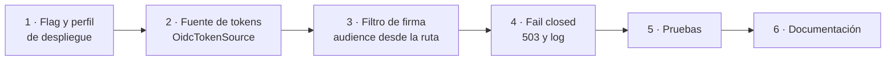
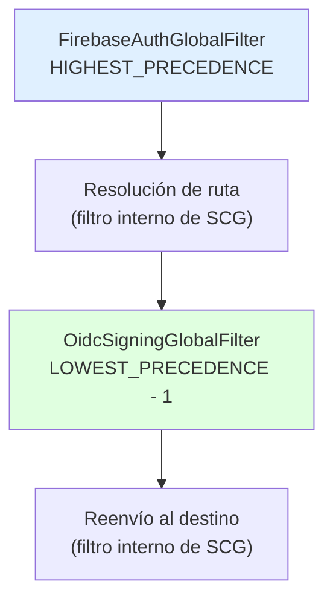

# Plan técnico — CM-104-correcciones-OIDC: Firma OIDC de las llamadas salientes

- **Spec de referencia:** `specs/CM-104-correcciones-OIDC/spec.md`
- **Fecha:** 11/09/2026
- **Flujo SDD:** Fase 3 — Diseño técnico (spec aprobado)
- **Rama:** `CM-104-correcciones-OIDC` → `develop`
- **Prerequisito:** `specs/CM-104-correcciones/` mergeado en `develop`

---

## 1. Resumen del cambio

Cuatro clases nuevas, un archivo de configuración nuevo, y ni una línea tocada en
`FirebaseAuthGlobalFilter`. La capa de firma es **independiente** de la de identidad: se engancha
más abajo en la cadena de filtros y no necesita el token de Firebase para nada.

```text
src/main/java/tech/cameia/gateway/
├── filter/
│   ├── OidcTokenSource.java           ← nueva · interfaz de una sola operación
│   ├── GoogleIdTokenSource.java       ← nueva · implementación real
│   ├── OidcSigningGlobalFilter.java   ← nueva · el filtro de salida
│   └── FirebaseAuthGlobalFilter.java  ← SIN CAMBIOS
└── config/
    └── OidcConfig.java                ← nueva · beans y guardia de arranque

src/main/resources/
├── application.yml                    ← se agrega el flag
├── application-local.yml              ← sin cambios (lo crea CM-104-correcciones)
└── application-prod.yml               ← se crea

docker-compose.yml                     ← variable nueva en el servicio app
.env.example                           ← variable nueva documentada
```

### Por qué una interfaz y no una sola clase

`OidcTokenSource` existe por un motivo concreto, no por gusto de abstraer: **`REQ-NF-OIDC-03` exige
que la suite corra sin credenciales de Google**. Con la interfaz, la prueba inyecta una fuente falsa
que devuelve `oidc-token-para-<audience>` y afirma sobre el audience pedido. Sin ella, probar la
firma exigiría un proyecto de GCP y, en la práctica, dejaría de probarse.

Es la misma solución que el repositorio ya usa para Firebase: `TestFirebaseConfig` produce un
`mock(FirebaseAuth.class)` y la suite no necesita credenciales reales.

### Por qué la interfaz vive en `filter` y no en `config`

La regla ArchUnit `filterNoImportaConfig`
(`src/test/java/tech/cameia/gateway/arch/GatewayArchTest.java:25`) prohíbe que una clase de
`filter` acceda al paquete `config`. Por eso:

- `OidcTokenSource` y sus implementaciones viven en `filter`.
- `OidcConfig` (paquete `config`) **construye** esos beans: config puede mirar a filter, no al revés.
- El filtro recibe `OidcTokenSource` por constructor, igual que `FirebaseAuthGlobalFilter` recibe
  `FirebaseAuth`.

---

## 2. Orden de implementación



Motivo del orden: el flag va primero porque todo lo demás cuelga de él, y mientras esté apagado el
código nuevo no altera el comportamiento actual. La suite queda en verde al cerrar cada bloque.

---

## 3. Diseño por componente

### 3.1 Dónde se engancha el filtro

Spring Cloud Gateway resuelve la ruta, reescribe la URL de destino y al final reenvía. La firma
tiene que ocurrir **entre** esos dos momentos: antes no se sabe el destino, después ya se envió.

Un `GlobalFilter` corre para **todas** las rutas, así que una ruta nueva en `application.yml` queda
firmada sin escribir una línea de Java. Es lo que exige `REQ-NF-OIDC-01`, y lo que evita el fallo
previsible: olvidarse de firmar la séptima ruta.



| Filtro | Orden | Quién lo pone |
|---|---|---|
| `FirebaseAuthGlobalFilter` | `HIGHEST_PRECEDENCE` | Ya existe, **no cambia** |
| Resolución de ruta | orden intermedio fijo de SCG | Spring Cloud Gateway |
| `OidcSigningGlobalFilter` | `LOWEST_PRECEDENCE - 1` | Este spec |
| Reenvío al destino | `LOWEST_PRECEDENCE` | Spring Cloud Gateway |

> ⚠️ **Verificar al implementar, no dar por hecho:** el orden exacto del filtro de reenvío y el
> nombre de la constante del atributo de ruta en Spring Cloud Gateway 5.0.3. Se comprueban leyendo
> las clases del jar en el IDE antes de escribir la constante. Si el reenvío no estuviera en
> `LOWEST_PRECEDENCE`, el valor de `getOrder()` se ajusta a lo que diga la librería. La prueba 1 de
> §4 falla de inmediato si el orden queda mal, así que el error no puede pasar desapercibido.

### 3.2 El audience sale de la ruta

Una vez resuelta la ruta, el `exchange` lleva como atributo el objeto `Route` que atendió la
petición, y su `uri` es literalmente el valor que el YAML declara:

```java
Route route = exchange.getAttribute(GATEWAY_ROUTE_ATTR);   // constante de SCG, verificar nombre
URI target = route.getUri();                               // p. ej. https://cameia-perfil-xxx.run.app
```

Normalización, que es donde se pierden las horas:

```java
/** Audience = esquema://host[:puerto]. Sin path, sin barra final. */
private String audienceOf(URI uri) {
    String base = uri.getScheme() + "://" + uri.getHost();
    return uri.getPort() == -1 ? base : base + ":" + uri.getPort();
}
```

Tres decisiones que esta función codifica:

1. **No se usa la URL completa de la petición.** Ese otro atributo del `exchange` incluye el path
   (`/api/v1/profiles/me`), y un audience con path no coincide con el que espera Cloud Run.
2. **Se descarta la barra final.** Reconstruir el audience desde sus partes hace imposible que una
   barra de más en una variable de entorno rompa la llamada (`GW-TBD-12`).
3. **No hay variable nueva.** El audience es una función de la `uri` de la ruta, que ya existe
   (`REQ-OIDC-02`).

### 3.3 `OidcTokenSource` y `GoogleIdTokenSource`

```java
/** Entrega un token OIDC para un audience. La implementación real habla con Google. */
public interface OidcTokenSource {
    Mono<String> tokenFor(String audience);
}
```

```java
public class GoogleIdTokenSource implements OidcTokenSource {

    private final GoogleCredentials credentials;
    private final Map<String, IdTokenCredentials> porAudience = new ConcurrentHashMap<>();

    @Override
    public Mono<String> tokenFor(String audience) {
        return Mono.fromCallable(() -> tokenValue(audience))
                .subscribeOn(Schedulers.boundedElastic());   // REQ-NF-OIDC-02
    }

    private String tokenValue(String audience) throws IOException {
        IdTokenCredentials idToken = porAudience.computeIfAbsent(audience, this::build);
        idToken.refreshIfExpired();                          // la librería decide, no nosotros
        return idToken.getIdToken().getTokenValue();
    }
}
```

### 3.4 Qué se cachea y qué no

| Se cachea | No se cachea |
|---|---|
| El objeto de credenciales por audience, en un `ConcurrentHashMap` | La cadena del token |

Es la lectura literal de `AGENTS.md` §6.3 y de `REQ-OIDC-06`: el objeto de credenciales sabe cuándo
su token venció y lo renueva solo. Guardar la cadena obligaría a escribir esa lógica a mano, que es
la forma habitual de terminar sirviendo un token vencido. El mapa no se purga: hay seis audiences
posibles, uno por ruta, y el objeto pesa lo que un puñado de bytes.

> **Verificar al implementar:** que las credenciales por defecto del entorno implementan
> `IdTokenProvider`. Una service account sí. Unas credenciales de usuario obtenidas con
> `gcloud auth application-default login` **no siempre**, y el síntoma es un `ClassCastException`
> al arrancar. El caso local está cubierto porque ahí el paso de firma va apagado.

### 3.5 `OidcSigningGlobalFilter`

```java
@Override
public Mono<Void> filter(ServerWebExchange exchange, GatewayFilterChain chain) {
    Route route = exchange.getAttribute(GATEWAY_ROUTE_ATTR);
    if (route == null) {
        return chain.filter(exchange);         // no hay destino que firmar
    }
    String audience = audienceOf(route.getUri());

    return tokenSource.tokenFor(audience)
            .flatMap(token -> chain.filter(withOidcToken(exchange, token)))
            .onErrorResume(e -> failClosed(exchange, audience, e));
}

/** El Authorization saliente es SOLO el token OIDC: set reemplaza, header añade. */
private ServerWebExchange withOidcToken(ServerWebExchange exchange, String token) {
    ServerHttpRequest request = exchange.getRequest().mutate()
            .headers(h -> h.set(HttpHeaders.AUTHORIZATION, "Bearer " + token))
            .build();
    return exchange.mutate().request(request).build();
}
```

Dos detalles que son requisito, no estilo:

- `h.set(...)`, nunca `.header(...)`. Es la misma trampa que `CM-104-correcciones` corrige para los
  `X-User-*`: `.header(...)` añade un segundo valor en vez de reemplazar (`REQ-OIDC-03`).
- El filtro **no distingue Caso A de Caso B**. No sabe ni le importa si hubo token de Firebase: por
  eso firma las dos clases de ruta sin que nadie tenga que acordarse de hacerlo (`REQ-OIDC-01`).

### 3.6 Fail closed

```java
private Mono<Void> failClosed(ServerWebExchange exchange, String audience, Throwable e) {
    logger.error("No se pudo firmar la llamada saliente [requestId={}, audience={}]",
            requestId(exchange), audience, e);                         // REQ-OIDC-09
    return Mono.error(new ResponseStatusException(HttpStatus.SERVICE_UNAVAILABLE));
}
```

El detalle va al log; el cuerpo lo construye `GlobalErrorHandler` desde el catálogo cerrado que
introduce `CM-104-correcciones` §3.5, así que el cliente recibe
`{"code":"SERVICE_UNAVAILABLE","message":"Servicio destino no disponible"}` y nada más. El
`ResponseStatusException` se lanza **sin `reason`**: cualquier texto que se le pase podría acabar en
la respuesta.

**No existe una rama que reenvíe sin firmar.** Si el token no se obtiene, la petición no sale.

### 3.7 El flag: por qué el nombre de la propiedad importa

Este es el punto fino del spec, y el único donde una elección descuidada rompe `REQ-OIDC-07` sin que
nada lo delate.

| Archivo | Valor |
|---|---|
| `application.yml` | `gateway.oidc.signing-enabled: ${GATEWAY_OIDC_ENABLED:false}` |
| `application-prod.yml` | `gateway.oidc.signing-enabled: true` ← literal, sin placeholder |

La propiedad **no** se llama `gateway.oidc.enabled`. Si se llamara así, la variable de entorno
`GATEWAY_OIDC_ENABLED` se enlazaría directamente a ella por el enlace relajado de Spring, y las
variables de entorno pesan más que **cualquier** archivo de configuración, perfil incluido. Es
decir: alguien podría apagar la firma en despliegue con una variable de entorno, que es exactamente
lo que `AGENTS.md` §6.3 prohíbe.

Con el nombre desacoplado, la variable solo alimenta el placeholder del archivo base, y en el perfil
de despliegue gana el literal. El desarrollo local no se entera: sigue usando `GATEWAY_OIDC_ENABLED`
como siempre.

### 3.8 Beans y guardia de arranque

```java
@Configuration
@ConditionalOnProperty(name = "gateway.oidc.signing-enabled", havingValue = "true")
public class OidcConfig {

    /** Credenciales reales. Se apagan en tests igual que FirebaseConfig. */
    @Bean
    @ConditionalOnProperty(name = "gateway.oidc.google-credentials.enabled",
                           havingValue = "true", matchIfMissing = true)
    OidcTokenSource googleIdTokenSource() throws IOException {
        return new GoogleIdTokenSource(GoogleCredentials.getApplicationDefault());
    }

    @Bean
    OidcSigningGlobalFilter oidcSigningGlobalFilter(OidcTokenSource source) {
        return new OidcSigningGlobalFilter(source);
    }
}
```

Con el flag apagado no se crea ningún bean: no hay filtro, no hay credenciales y el arranque local
no necesita nada de Google. Es el mismo mecanismo de `FirebaseConfig`, que ya se apaga con
`gateway.firebase.enabled=false` en el perfil de tests.

El guardia de `REQ-OIDC-07`, tercera cláusula, vive aparte porque debe correr **aunque el flag esté
apagado**:

```java
@Component
@Profile("prod")
class OidcRequiredInProd {

    OidcRequiredInProd(@Value("${gateway.oidc.signing-enabled:false}") boolean enabled) {
        if (!enabled) {
            throw new IllegalStateException(
                "El perfil prod exige la firma OIDC de las llamadas salientes (AGENTS.md §6.3)");
        }
    }
}
```

> **No se reintroduce ninguna clase `@ConfigurationProperties`.** `CM-104-correcciones` eliminó
> `GatewayProperties` por estar declarada e inerte (`REQ-14`), y aquí `@ConditionalOnProperty` y un
> `@Value` cubren la necesidad sin volver a crear el problema.

### 3.9 `application-prod.yml` — qué lleva y qué no

```yaml
# Perfil de despliegue. Lo que aquí se fija NO se puede apagar por variable de entorno.
gateway:
  oidc:
    signing-enabled: true    # REQ-OIDC-07 — literal a propósito, no ${...}

logging:
  level:
    org.springframework.cloud.gateway: WARN
```

Nada más. Las URLs de los microservicios, el origen de CORS y el timeout siguen llegando por
variable de entorno: son valores que cambian entre proyectos de GCP y no deben quedar congelados en
el jar. Lo único que se fija es lo que **no debe poder apagarse**.

### 3.10 Compose y `.env.example`

```yaml
# docker-compose.yml, servicio app
GATEWAY_OIDC_ENABLED: ${GATEWAY_OIDC_ENABLED:-false}
```

```bash
# .env.example
# ── Firma OIDC hacia los microservicios ─────────────────────
# En local va en false: los microservicios son contenedores HTTP sin IAM
# y no hay credenciales de Google. En despliegue el perfil prod la fuerza
# a true y esta variable no tiene efecto.
GATEWAY_OIDC_ENABLED=false
```

---

## 4. Estrategia de pruebas

Clase nueva `OidcSigningFilterTest`, con la misma infraestructura que ya usa
`FirebaseAuthGlobalFilterTest`: `@SpringBootTest` con puerto aleatorio, `WebTestClient` y
`MockWebServer` como microservicio simulado.

La configuración de prueba sigue el patrón de `TestFirebaseConfig`:

```java
@TestConfiguration
class TestOidcConfig {

    static final List<String> AUDIENCES_PEDIDOS = new CopyOnWriteArrayList<>();
    static volatile boolean fallar = false;

    @Bean
    OidcTokenSource fakeTokenSource() {
        return audience -> {
            AUDIENCES_PEDIDOS.add(audience);
            return fallar
                    ? Mono.error(new IllegalStateException("sin credenciales"))
                    : Mono.just("oidc-para-" + audience);
        };
    }
}
```

En `application-test.yml` se agrega `gateway.oidc.google-credentials.enabled: false`, para que la
implementación real nunca se construya en pruebas. El flag de firma se enciende por clase de prueba
con `@SpringBootTest(properties = "gateway.oidc.signing-enabled=true")`.

| # | Prueba | Qué demuestra | Requisito |
|---|---|---|---|
| 1 | Caso A con token válido → el destino recibe `Authorization: Bearer oidc-para-...`, un solo valor | La firma ocurre y reemplaza | `REQ-OIDC-01`, `REQ-OIDC-03` |
| 2 | El audience pedido a la fuente coincide con la URI de la ruta (host y puerto de `MockWebServer`), sin path ni barra final | El audience sale de la ruta | `REQ-OIDC-02` |
| 3 | `POST /webhooks/wompi` sin token de Firebase → el destino recibe igualmente el token OIDC | Caso B también se firma | `REQ-OIDC-01` |
| 4 | El cliente envía `Authorization: Basic xyz` a `/webhooks/wompi` → el destino recibe el OIDC, y `Basic xyz` no aparece | El valor del cliente se reemplaza | `REQ-OIDC-03` |
| 5 | Caso A: el `Authorization` que recibe el destino no contiene el ID Token de Firebase enviado por el cliente | El token de Firebase no sale | `REQ-OIDC-03` |
| 6 | La fuente falla → `503` con `code: SERVICE_UNAVAILABLE`, el cuerpo no contiene `Exception`, `java.`, el audience ni el host, y `MockWebServer` no recibe ninguna petición | Fail closed y sin fuga | `REQ-OIDC-04`, `REQ-OIDC-09` |
| 7 | Con el flag apagado (clase de prueba sin la propiedad): el destino no recibe `Authorization`, y el `401` sin token de Firebase sigue funcionando | El flag apaga solo la salida | `REQ-OIDC-07`, `REQ-OIDC-08` |
| 8 | `application-prod.yml` declara `signing-enabled: true` literal, sin `${` | El entorno no puede apagarlo | `REQ-OIDC-07` |

La prueba 8 no arranca ningún contexto: lee el archivo del classpath y afirma sobre su contenido. Es
el modo barato de fijar una regla que, de otra forma, solo se descubriría rota en despliegue.

**Dos requisitos quedan sin prueba automática, y conviene decirlo en voz alta:** `REQ-OIDC-05`
(credenciales por defecto) y `REQ-OIDC-06` (renovación delegada en la librería) solo se pueden
observar con credenciales reales de Google, que `REQ-NF-OIDC-03` prohíbe exigir en la suite. Se
verifican por revisión de código en el PR, con dos preguntas: que `GoogleIdTokenSource` es el único
sitio que llama a `getApplicationDefault()`, y que en ningún lugar se guarda la cadena del token.
`T-INF-04` los cubre de verdad el día del despliegue.

La prueba 6 comprueba `mockDownstream.getRequestCount()` antes y después: que responda `503` no
basta, hay que demostrar que **no se reenvió nada**.

### Pruebas existentes que cambian

| Prueba actual | Cambio |
|---|---|
| `FirebaseAuthGlobalFilterTest` completa | **No cambia.** Corre con el flag apagado, que es el valor por defecto, y sigue afirmando que el `Authorization` saliente está vacío |

### ArchUnit

Sin reglas nuevas. `filterNoImportaConfig` debe seguir en verde: ninguna de las tres clases de
`filter` importa nada de `config`. Es la prueba que justifica el reparto de §1.

---

## 5. Documentación a actualizar en el mismo PR

| Archivo | Qué cambia |
|---|---|
| `AGENTS.md` §4 | Entran `OidcTokenSource`, `GoogleIdTokenSource`, `OidcSigningGlobalFilter` y `OidcConfig` en la tabla de componentes. Sale la nota de que el componente de §6.3 no existe |
| `AGENTS.md` §6.5 | La tabla de brechas queda vacía: se anota la fecha y el PR que la cerró |
| `AGENTS.md` §9 | `GATEWAY_OIDC_ENABLED` pasa de promesa a variable real, con la aclaración de que en `prod` no tiene efecto |
| `docs/COMO-FUNCIONA.md` §3 | Deja de decir que no existe una sola línea de firma OIDC. Se reescribe con el estado real |
| `docs/COMO-FUNCIONA.md` §4 | El perfil de despliegue ya no es una etiqueta vacía |
| `README.md` | Una línea en la tabla de variables |
| `.env.example` | La variable nueva, documentada |

---

## 6. Riesgos y mitigaciones

| Riesgo | Probabilidad | Mitigación |
|---|---|---|
| El audience no coincide con lo que espera Cloud Run, por la barra final | **Alta** | §3.2 reconstruye el audience desde sus partes en vez de copiar la cadena. `GW-TBD-12` lo confirma al desplegar. El síntoma es un `401` del destino, no del Gateway |
| El nombre de la constante del atributo de ruta cambió en SCG 5.x | Media | Se verifica leyendo la clase en el IDE antes de escribirla. La prueba 2 falla en el acto si se toma el atributo equivocado |
| El filtro queda con un orden posterior al reenvío y la cabecera no llega | Media | La prueba 1 lo detecta de inmediato: el destino recibiría la petición sin `Authorization` |
| Las credenciales locales de un desarrollador no implementan `IdTokenProvider` | Media | En local el paso va apagado. Si alguien lo enciende, el fallo ocurre al arrancar y el mensaje es claro |
| Cuentas depende del `Authorization` entrante del webhook de Wompi | Baja | `GW-TBD-14`, se pregunta antes de implementar. Wompi firma el cuerpo, no la cabecera |
| Un microservicio sin desplegar hace fallar la ruta con `503` en vez de con el error de antes | Baja | `GW-TBD-13`. Esas rutas ya fallaban por no tener servicio detrás; cambia el código de error, no el hecho |
| La caché por audience crece sin control | Muy baja | Hay tantas entradas como rutas: seis. No se purga a propósito |

---

## 7. Estimación

| Bloque | Tareas | Tiempo |
|---|---|---|
| 0 · Infraestructura GCP | 4 | Bloqueado, no estimado |
| 1 · Flag y perfil de despliegue | 5 | ~1 h 30 |
| 2 · Fuente de tokens | 4 | ~1 h 30 |
| 3 · Filtro de firma | 4 | ~2 h |
| 4 · Fail closed | 2 | ~45 min |
| 5 · Pruebas | 6 | ~2 h 30 |
| 6 · Documentación | 5 | ~1 h 15 |
| 7 · Cierre | 3 | ~45 min |

Total estimado: **~10 horas** de implementación, en tareas de 30 minutos o menos. Ninguna exige
acceso a GCP: el Bloque 0 es independiente y lo ejecuta quien administre el proyecto.
