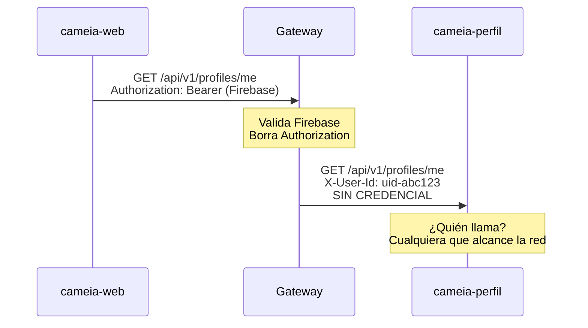
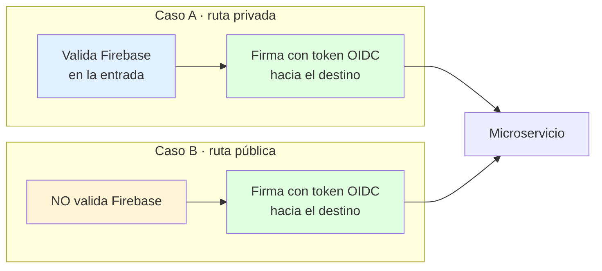

# Spec — CM-104-correcciones-OIDC: Firma OIDC de las llamadas salientes del Gateway

- **HU asociada:** CM-104 (revisión) — brecha bloqueante detectada al escanear la base técnica
- **Sprint:** 1
- **Fecha:** 11/09/2026
- **Estado:** propuesta pendiente de aprobación
- **Flujo SDD:** Fase 1 — Requisitos EARS
- **Rama:** `CM-104-correcciones-OIDC` → `develop`
- **Fuentes:**
  `AGENTS.md` §6.2, §6.3 y §6.5 (modelo de seguridad aprobado),
  `docs/COMO-FUNCIONA.md` §3 (escaneo del código, 11/09/2026),
  `specs/CM-104-correcciones/spec.md` (lo que este spec continúa),
  `specs/CM-104-base-tecnica/spec.md` (requisitos originales).

---

## 1. Contexto

El Gateway de hoy autentica usuarios y enruta. Nada más. La petición llega al microservicio
**sin ninguna credencial**: solo con las cabeceras `X-User-*` que el Gateway escribe.



Cualquiera que alcance la red del microservicio puede llamarlo directamente inventando la cabecera
`X-User-Id`. Por eso `docs/COMO-FUNCIONA.md` lo marca como **bloqueante para despliegue**, y por eso
es la única fila que `specs/CM-104-correcciones/` deja abierta en la tabla de brechas de
`AGENTS.md` §6.5.

### Son dos capas independientes, no dos versiones de la misma



- **Firebase** responde *"¿quién es este usuario?"*. Mira al navegador. Solo en Caso A.
- **OIDC** responde *"¿tiene derecho este Gateway a llamar a este microservicio?"*. Mira a la nube.
  **En los dos casos, sin excepción.**

Lo único que distingue al Caso B es que se salta la validación de Firebase en la entrada. El paso
hacia el microservicio es idéntico. Confundir las dos capas es, según `AGENTS.md` §6, el error más
caro de este repositorio.

### Qué agrega este spec

Un único componente reutilizable que firma toda petición saliente, el flag que lo apaga en
desarrollo local, y el perfil de despliegue donde ese flag queda forzado. Ninguna regla de negocio,
ninguna ruta nueva, ninguna variable de audience.

---

## 2. Prerequisitos

| Prerequisito | Estado | Por qué importa |
|---|---|---|
| `specs/CM-104-correcciones/` implementado y mergeado en `develop` | Pendiente | Este spec firma la petición **después** de que el filtro de identidad la haya saneado. Reutiliza `withIdentity` y `withoutIdentity`, y el archivo del perfil de despliegue se apoya en el `application-local.yml` que aquel spec crea |
| Infraestructura de GCP (`GW-TBD-10` … `GW-TBD-13`) | **No configurada** | Bloquea el despliegue y la verificación de extremo a extremo, **no** la implementación ni la suite: el código se escribe y se prueba con el paso de firma apagado y una fuente de tokens simulada |

> **Consecuencia práctica:** los Bloques 1 a 7 de `tasks.md` se pueden completar hoy. El Bloque 0
> queda esperando a que exista el proyecto de GCP.

### Fuera de alcance

| Tema | Por qué queda fuera |
|---|---|
| Despliegue real a Cloud Run y pipeline de CI/CD | Este spec deja el servicio *listo* para desplegarse firmado. Desplegarlo es trabajo propio, con su ticket |
| Rate limit y circuit breaker | Fuera de alcance por decisión escrita en CM-113. Necesitan contador compartido (Redis) o control previo al Gateway (Cloud Armor) |
| mTLS entre Gateway y microservicios | Fuera de alcance por decisión escrita en CM-113. El token OIDC cubre la necesidad de autenticar al llamante |
| Autorización por rol dentro del Gateway | `AGENTS.md` §6.1 paso 3 la contempla, pero ninguna ruta la exige todavía. Entra con la HU que la necesite |
| Cambios en el contrato de cabeceras `X-User-*` | Lo fija `specs/CM-104-correcciones/` §2.1. Aquí no se toca |

---

## 3. Requisitos funcionales — notación EARS

Numeración propia: `REQ-OIDC-NN`. No continúa la de CM-104 porque aquí no se corrige ningún
requisito existente: se agrega una capa que nunca existió.

### 3.1 La firma saliente

#### REQ-OIDC-01 — Toda petición saliente va firmada

```
Cuando el sistema reenvía una solicitud a un microservicio destino,
el sistema debe adjuntar un token OIDC firmado por Google
en la cabecera `Authorization: Bearer <token>`.
```

```
Mientras el paso de firma está activo, el sistema debe adjuntar el token OIDC
tanto en las rutas que exigen usuario autenticado como en las que no.
```

> No hay ruta exenta. `/webhooks/wompi` no exige token de Firebase porque Wompi no es un usuario del
> sistema, pero la llamada del Gateway a cameia-cuentas sí necesita demostrar que la hace el Gateway.
> Los endpoints de Actuator no son rutas del Gateway: los atiende el propio servicio y no hay paso
> saliente que firmar.

#### REQ-OIDC-02 — El audience es la URL del destino, y sale de la ruta

```
El sistema debe construir el token OIDC con un `audience` igual a la URL
del microservicio destino declarada en el campo `uri` de la ruta que atendió
la solicitud.
```

```
El sistema no debe leer el `audience` de una variable de entorno distinta
de la que ya define la URL del microservicio destino.
```

> Dos valores que significan lo mismo terminan divergiendo. La URL destino ya vive en
> `CAMEIA_PERFIL_URL`, `CAMEIA_CUENTAS_URL` y las demás: el audience se deriva de ahí y de ningún
> otro sitio. Un audience que no coincide produce un `401` de Cloud Run cuyo mensaje no menciona el
> audience, y es la causa más común de horas perdidas en este paso.

#### REQ-OIDC-03 — El `Authorization` saliente es solo el token OIDC

```
El sistema nunca debe reenviar al microservicio destino el ID Token de Firebase
recibido del cliente.
```

```
Cuando la solicitud entrante incluye una cabecera `Authorization`,
el sistema debe reemplazar su valor por el token OIDC antes de reenviar la solicitud,
tanto en rutas protegidas como en rutas públicas.
```

> Reemplazar, no agregar. Dos valores en la misma cabecera dejan indefinido cuál lee el destino.
> La identidad del usuario viaja en las cabeceras `X-User-*`, que es justo para lo que existen.

#### REQ-OIDC-04 — Fail closed

```
Si el sistema no logra obtener el token OIDC para el microservicio destino,
entonces el sistema debe responder `503` y no debe reenviar la solicitud.
```

> Una petición sin firmar que llega igual al microservicio es peor que un error: deja pasar
> exactamente lo que este spec existe para impedir. Ante la duda, no se reenvía.

### 3.2 Credenciales

#### REQ-OIDC-05 — Credenciales por defecto de la aplicación

```
El sistema debe obtener las credenciales para firmar desde las Application Default
Credentials del entorno de ejecución.
```

```
El sistema no debe requerir ningún archivo de clave propio ni ninguna variable
de entorno con material secreto para firmar las llamadas salientes.
```

> En Cloud Run las Application Default Credentials salen del metadata server con la identidad de la
> service account del Gateway. Son las mismas credenciales que ya usa el Admin SDK de Firebase.

#### REQ-OIDC-06 — La renovación la hace la librería

```
El sistema no debe almacenar la cadena del token OIDC
ni debe programar su renovación por cuenta propia.
```

> El token vive cerca de una hora. La librería de credenciales sabe cuándo renovarlo; una caché
> escrita a mano solo agrega una forma nueva de servir un token vencido.

### 3.3 El flag y el entorno

#### REQ-OIDC-07 — Apagado en local, forzado en despliegue

```
Cuando el sistema corre con el perfil `local`,
el paso de firma debe estar desactivado por defecto
y el sistema debe reenviar la solicitud sin token OIDC.
```

```
Cuando el sistema corre con el perfil de despliegue,
el paso de firma debe estar activo, y ninguna variable de entorno
debe poder desactivarlo.
```

```
Si el sistema arranca con el perfil de despliegue y el paso de firma desactivado,
entonces el sistema debe fallar el arranque.
```

> En desarrollo local los microservicios son contenedores HTTP sin IAM y no hay credenciales de
> Google: exigir la firma haría imposible trabajar. Un despliegue capaz de apagar la firma con una
> variable de entorno, en cambio, no es un despliegue seguro. La asimetría es deliberada.

#### REQ-OIDC-08 — El flag apaga solo el paso saliente

```
Mientras el paso de firma está desactivado, el sistema debe seguir validando
el ID Token de Firebase en las rutas protegidas y debe seguir emitiendo
las cabeceras `X-User-*` y `X-Request-Id`.
```

### 3.4 Errores y trazabilidad

#### REQ-OIDC-09 — El fallo se registra, no se le cuenta al cliente

```
Mientras el sistema responde un error originado en el paso de firma,
debe registrar en el log la causa original junto con el `X-Request-Id`
de la solicitud.
```

```
El sistema nunca debe incluir en el cuerpo de la respuesta el mensaje de la excepción,
el `audience` solicitado, el nombre del host destino ni la URL interna del microservicio.
```

> Es el criterio de `REQ-12` de `specs/CM-104-correcciones/`, aplicado a la causa de error que este
> spec introduce. El catálogo de errores no crece: `503 SERVICE_UNAVAILABLE` ya existe.

---

## 4. Requisitos no funcionales

### REQ-NF-OIDC-01 — Un solo componente, aplicado a todas las rutas

```
El sistema debe aplicar la firma saliente desde un único componente reutilizable,
y no debe duplicar esa lógica por endpoint ni por microservicio destino.
```

> Una ruta nueva en `application.yml` queda firmada sin escribir una línea de Java. Es la propiedad
> que hace sostenible el modelo: lo contrario es olvidarse de firmar la séptima ruta.

### REQ-NF-OIDC-02 — Sin bloquear el hilo de evento

```
Mientras el sistema obtiene un token OIDC, debe ejecutar la llamada bloqueante
fuera del hilo de evento reactivo.
```

> Misma regla que ya aplica `FirebaseAuth.verifyIdToken()` en el filtro de autenticación
> (`AGENTS.md` §6.1).

### REQ-NF-OIDC-03 — La suite corre sin GCP

```
Cuando se ejecuta `docker compose run --rm verify`,
el sistema debe compilar y ejecutar la suite completa
sin credenciales de Google ni acceso a GCP.
```

> Requisito de proceso, no de comodidad: si probar la firma exigiera un proyecto de GCP, dejaría de
> probarse. La suite verifica el comportamiento con una fuente de tokens simulada.

---

## 5. Variables de entorno

Este spec agrega **una sola** variable. Las de CM-104 §4 siguen vigentes sin cambios.

| Variable | Default | Dónde aplica |
|---|---|---|
| `GATEWAY_OIDC_ENABLED` | `false` | Solo en perfil `local`. En el perfil de despliegue **no tiene efecto**: el valor queda fijado en el archivo de perfil y la variable no puede sobrescribirlo (`REQ-OIDC-07`) |

**No se agrega ninguna variable de audience.** El audience sale de `CAMEIA_*_URL`, que ya existe
(`REQ-OIDC-02`).

---

## 6. Lo que este spec NO decide (abierto)

Continúa la serie de `specs/CM-104-correcciones/` §5, que llegó hasta `GW-TBD-09`.

| ID | Tema | Impacto | Quién decide |
|---|---|---|---|
| `GW-TBD-10` | Nombre y proyecto de la service account con la que corre el Gateway en Cloud Run | Ninguno sobre el código: las credenciales por defecto la resuelven solas | Arquitectura / infraestructura |
| `GW-TBD-11` | Quién concede `roles/run.invoker` de cada microservicio a esa identidad, y cuándo | Bloquea el despliegue, no la implementación | Arquitectura / infraestructura |
| `GW-TBD-12` | URL exacta de Cloud Run de cada microservicio y su forma canónica, con o sin barra final | El audience debe coincidir carácter a carácter | Infraestructura, al desplegar cada servicio |
| `GW-TBD-13` | Qué audience se usa para un microservicio todavía no desplegado (voz, auditoría) | Hoy ninguno: esas rutas fallan igual por no tener servicio detrás | Arquitectura, en Sprint 2/3 |
| `GW-TBD-14` | Confirmar con Cuentas que el webhook de Wompi se autentica por la firma del cuerpo y no por `Authorization`, que este spec reemplaza | Si Cuentas dependiera del `Authorization` entrante, habría que revisar `REQ-OIDC-03` | Cuentas |

`GW-TBD-10` a `GW-TBD-13` **no bloquean la implementación**: ninguno cambia el código que aquí se
pide, y las pruebas no los necesitan. Sí bloquean el despliegue. `GW-TBD-14` se cierra preguntando,
no escribiendo código.

---

## 7. Criterio de terminado (DoD)

Implementación y pruebas, sin GCP:

- [ ] `docker compose run --rm verify` en verde, sin credenciales de Google en el entorno
- [ ] Con el paso de firma activo, una ruta de Caso A envía `Authorization` con el token OIDC y un solo valor (prueba de contrato)
- [ ] Con el paso de firma activo, `POST /webhooks/wompi` también llega firmado (prueba de contrato)
- [ ] Un cliente que envía su propio `Authorization` a una ruta pública no logra que ese valor llegue al microservicio (prueba de contrato)
- [ ] El ID Token de Firebase no aparece nunca en el `Authorization` saliente (prueba de contrato)
- [ ] El audience solicitado coincide con la `uri` de la ruta (prueba de contrato)
- [ ] Fallo al obtener el token → `503`, sin detalle interno en el cuerpo, y el microservicio no recibe nada (prueba de contrato)
- [ ] Con el paso de firma apagado, la solicitud sale sin `Authorization` y la validación de Firebase sigue funcionando (prueba de contrato)
- [ ] El archivo del perfil de despliegue fija el paso de firma sin placeholder, y hay una prueba que lo demuestra
- [ ] `.env.example` y `docker-compose.yml` documentan `GATEWAY_OIDC_ENABLED`
- [ ] `AGENTS.md` §4 incluye las clases nuevas y §6.5 queda **sin ninguna fila pendiente**
- [ ] `docs/COMO-FUNCIONA.md` §3 deja de decir que el paso OIDC no existe
- [ ] Ningún secreto real en el diff del PR
- [ ] Bitácora IA rellenada el mismo día
- [ ] Título del PR: `CM-104 | feat(gateway): firmar las llamadas salientes con token OIDC [IA-ASISTIDO]`

Despliegue, cuando GCP exista (Bloque 0 de `tasks.md`):

- [ ] La service account del Gateway tiene `roles/run.invoker` sobre cada microservicio destino
- [ ] Una llamada de extremo a extremo llega firmada y el microservicio la acepta
- [ ] Una llamada directa al microservicio, saltándose el Gateway, es rechazada
