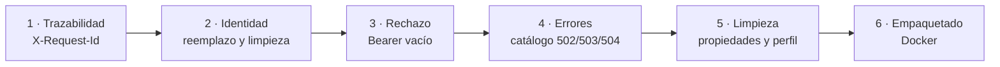

# Plan técnico — CM-104-correcciones: Endurecimiento de identidad, errores y empaquetado

- **Spec de referencia:** `specs/CM-104-correcciones/spec.md`
- **Fecha:** 11/09/2026
- **Flujo SDD:** Fase 3 — Diseño técnico (spec aprobado)
- **Rama:** `CM-104-correcciones` → `develop`

---

## 1. Resumen del cambio

Cinco archivos de código, dos de configuración, tres de documentación. **Ninguna clase nueva de
producción**, salvo una constante y un par de métodos privados en clases que ya existen.

```text
src/main/java/tech/cameia/gateway/
├── filter/FirebaseAuthGlobalFilter.java   ← el 70% del cambio
├── exception/GlobalErrorHandler.java      ← catálogo de errores
├── config/GatewayProperties.java          ← se elimina
└── GatewayApplication.java                ← pierde @EnableConfigurationProperties

src/main/resources/
├── application.yml                        ← CORS
└── application-local.yml                  ← se crea

Dockerfile                                 ← HEALTHCHECK + usuario no root
docker-compose.yml                         ← perfil para verify
```

### Por qué no se crea una clase por responsabilidad

La tentación es separar "filtro de autenticación" de "filtro de identidad" y de "filtro de
trazabilidad". No se hace, por dos razones:

1. Los tres necesitan el mismo token decodificado. Separarlos obliga a pasar el `FirebaseToken`
   entre filtros por los atributos del `exchange`, que es acoplamiento invisible y difícil de probar.
2. `AGENTS.md` §7 prohíbe crear clases que no estén en su tabla de componentes o en un spec
   aprobado. Este spec aprueba métodos, no clases.

El `X-Request-Id` sí es independiente del token, pero debe existir también en rutas públicas y en
las respuestas de error, así que vive en el mismo filtro global, antes de la bifurcación por caso.

---

## 2. Orden de implementación

El orden importa: cada bloque deja la suite en verde antes del siguiente.



Motivo del orden: el bloque 2 necesita el `X-Request-Id` del bloque 1 para poder registrar en el
log qué solicitud se saneó, y el bloque 4 necesita el mismo identificador para correlacionar el
error con la petición.

---

## 3. Diseño por componente

### 3.1 `FirebaseAuthGlobalFilter` — constantes y estructura

Se agrega el conjunto de cabeceras que el Gateway considera de su propiedad exclusiva. Es la
pieza que hace posible `REQ-07` y `REQ-10`:

```java
static final String X_USER_ID      = "X-User-Id";
static final String X_USER_EMAIL   = "X-User-Email";
static final String X_USER_ROLES   = "X-User-Roles";
static final String X_USER_PLAN    = "X-User-Plan";
static final String X_REQUEST_ID   = "X-Request-Id";

static final String PLAN_CLAIM  = "plan";
static final String ROLES_CLAIM = "roles";

/** Cabeceras que solo el Gateway emite: se descartan si llegan del cliente. */
private static final Set<String> IDENTITY_HEADERS = Set.of(
        X_USER_ID, X_USER_EMAIL, X_USER_ROLES, X_USER_PLAN
);
```

`X-Request-Id` **no** entra en `IDENTITY_HEADERS`: el cliente puede aportarlo y `REQ-09` obliga a
conservarlo. Es trazabilidad, no identidad.

### 3.2 Lectura de los claims

El claim `roles` puede llegar como cadena o como lista, y `GW-TBD-06` no está resuelto. La
implementación acepta ambos en lugar de esperar la decisión:

```java
private String readRoles(FirebaseToken token) {
    Object claim = token.getClaims().get(ROLES_CLAIM);
    if (claim == null) {
        return null;                                   // se omite la cabecera
    }
    if (claim instanceof Collection<?> values) {
        return values.stream().map(String::valueOf).collect(joining(","));
    }
    return String.valueOf(claim);                      // cadena única, tal cual
}
```

Reglas que este método respeta, y que son requisito (`REQ-08`), no estilo:

- **No cambia mayúsculas.** Si el token dice `premium`, se propaga `premium`. Si dice `PREMIUM`,
  se propaga `PREMIUM`. El Gateway no decide qué significa un rol.
- **No ordena ni deduplica** la lista.
- **No deduce `roles` a partir de `plan`** ni al contrario, aunque hoy lleven la misma información
  (`GW-TBD-09`).
- **Omite la cabecera si el claim falta**, igual que ya hace `plan`. Nunca envía cadena vacía.

`X-User-Email` sale de `token.getEmail()`, que puede ser `null` con métodos de login sin correo.
Mismo tratamiento: si es `null` o vacío, se omite la cabecera (`GW-TBD-07`).

### 3.3 Reemplazo en vez de adición — el corazón del cambio

El defecto actual está en una sola línea. `mutate().header(k, v)` **añade** un valor a la cabecera;
si el cliente ya envió esa cabecera, el microservicio recibe dos valores:

```java
// ANTES — añade
.header(X_USER_ID, token.getUid())

// DESPUÉS — reemplaza
.headers(h -> h.set(X_USER_ID, token.getUid()))
```

Diseño de los dos caminos:

```java
/** Caso A: ruta protegida. Emite la identidad del token y borra la que venga del cliente. */
private ServerWebExchange withIdentity(ServerWebExchange exchange, FirebaseToken token, String requestId) {
    ServerHttpRequest request = exchange.getRequest().mutate()
            .headers(h -> {
                IDENTITY_HEADERS.forEach(h::remove);        // 1. borra lo del cliente
                h.remove(HttpHeaders.AUTHORIZATION);        // 2. REQ-07
                h.set(X_USER_ID, token.getUid());           // 3. emite lo verificado
                setIfPresent(h, X_USER_EMAIL, token.getEmail());
                setIfPresent(h, X_USER_ROLES, readRoles(token));
                setIfPresent(h, X_USER_PLAN, readPlan(token));
                h.set(X_REQUEST_ID, requestId);
            })
            .build();
    return exchange.mutate().request(request).build();
}

/** Caso B: ruta pública. No hay usuario, así que no debe quedar rastro de identidad. */
private ServerWebExchange withoutIdentity(ServerWebExchange exchange, String requestId) {
    ServerHttpRequest request = exchange.getRequest().mutate()
            .headers(h -> {
                IDENTITY_HEADERS.forEach(h::remove);
                h.set(X_REQUEST_ID, requestId);
            })
            .build();
    return exchange.mutate().request(request).build();
}
```

> **Decisión:** en ruta pública **no** se elimina el `Authorization` entrante. `/webhooks/wompi`
> es el único caso y Wompi autentica su webhook con firma en el cuerpo, no con esa cabecera.
> Cuando entre el spec de OIDC, esa cabecera pasará a contener el token de Google y esta decisión
> se revisa allí. Queda anotada aquí para que el cambio no parezca un descuido.

### 3.4 Bearer vacío y errores de Firebase

Dos correcciones en el mismo método. Primero, validar el formato antes de llamar a Firebase:

```java
String idToken = authHeader.substring(BEARER_PREFIX.length()).trim();
if (idToken.isEmpty()) {
    return writeUnauthorized(exchange, "Token de acceso requerido");
}
```

Segundo, ampliar la captura. Hoy solo se atrapa `FirebaseAuthException`, y cualquier otra
excepción de `verifyIdToken` sube hasta el manejador global y sale como `500`:

```java
// ANTES
.onErrorResume(FirebaseAuthException.class, e -> writeUnauthorized(...))

// DESPUÉS
.onErrorResume(e -> isTokenRejection(e), e -> writeUnauthorized(exchange, "Token de acceso inválido"))
```

donde `isTokenRejection` cubre `FirebaseAuthException` e `IllegalArgumentException`. No se captura
`Throwable` en bruto: un fallo de red al descargar las claves públicas de Firebase **no es** un
token inválido y debe seguir siendo un `500`, porque el problema es del Gateway, no del cliente.

### 3.5 `GlobalErrorHandler` — catálogo cerrado

Dos cambios: mapear más excepciones y dejar de copiar el mensaje de la excepción al cuerpo.

```java
private static final Map<HttpStatus, ErrorBody> CATALOGO = Map.of(
    UNAUTHORIZED,        new ErrorBody("AUTH_REQUIRED",       "Token de acceso requerido o inválido"),
    NOT_FOUND,           new ErrorBody("NOT_FOUND",           "Recurso no encontrado"),
    BAD_GATEWAY,         new ErrorBody("BAD_GATEWAY",         "Respuesta inválida del servicio destino"),
    SERVICE_UNAVAILABLE, new ErrorBody("SERVICE_UNAVAILABLE", "Servicio destino no disponible"),
    GATEWAY_TIMEOUT,     new ErrorBody("GATEWAY_TIMEOUT",     "El servicio destino no respondió a tiempo")
);
private static final ErrorBody POR_DEFECTO =
    new ErrorBody("INTERNAL_ERROR", "Error interno del gateway");
```

Mapeo de excepción a estado:

| Excepción | Estado | Por qué |
|---|---|---|
| `ResponseStatusException` | el suyo | Spring Cloud Gateway ya traduce algunos casos; se respeta |
| `TimeoutException` | `504` | El timeout de respuesta configurado en `httpclient` |
| `ConnectException`, `UnknownHostException` | `503` | El destino no existe o no acepta conexiones |
| `PrematureCloseException` y otras de `reactor.netty` | `502` | El destino cortó o devolvió algo ininterpretable |
| cualquier otra | `500` | Fallo del Gateway |

> **Incertidumbre reconocida:** Spring Cloud Gateway puede envolver el timeout en un
> `ResponseStatusException(504)` por su cuenta, en cuyo caso la rama de `TimeoutException` nunca
> se usa. No importa: el requisito `REQ-11` está escrito sobre el comportamiento observable
> (la respuesta es `504`), y la prueba verifica eso, no qué rama se ejecutó. La rama se mantiene
> porque cubre el caso si el comportamiento de la librería cambia.

El cuerpo se construye desde el catálogo y la excepción va al log, nunca a la respuesta:

```java
logger.error("Fallo al enrutar la solicitud [requestId={}]", requestId, ex);
```

El escape de JSON deja de ser un `replace` de comillas: el cuerpo ya no contiene texto de origen
externo, así que el mensaje es una constante del catálogo y no hay nada que escapar.

### 3.6 `GatewayProperties` — se elimina

La clase está declarada, anotada `@Validated`, y nada la lee. Se elimina, junto con
`@EnableConfigurationProperties(GatewayProperties.class)` en `GatewayApplication`.

**Por qué eliminar y no enlazar:** enlazarla exigiría mover CORS y el timeout de YAML a
configuración Java, y el plan de CM-104 §3.5 decidió explícitamente lo contrario ("CORS —
`application.yml`, global, no en Java"). Mantener la clase enlazada a medias es lo que produjo
el problema. El fail-fast de variables obligatorias (`REQ-06`) no depende de ella: lo produce el
placeholder `${FIREBASE_PROJECT_ID}` sin resolver, como demuestra `GatewayStartupTest`.

Las claves `gateway.cors-allowed-origin` y `gateway.timeout` de `application-test.yml` quedan sin
consumidor y se eliminan también. `gateway.firebase.enabled` **se queda**: la usa el
`@ConditionalOnProperty` de `FirebaseConfig`.

> Si más adelante se quiere configuración tipada de verdad, el spec de OIDC es el lugar natural:
> `gateway.oidc.enabled` sí necesita leerse desde Java.

### 3.7 `application.yml` — CORS

```yaml
allowedHeaders:
  - Authorization
  - Content-Type
  - X-Request-Id      # el cliente puede aportarlo (REQ-09)
# X-User-Id y X-User-Plan se retiran: solo el Gateway las emite (REQ-NF-01)
```

### 3.8 `application-local.yml` — se crea

`REQ-15`. No es un placeholder vacío: contiene lo único que de verdad distingue al desarrollo
local, que es querer ver por qué una ruta no coincide.

```yaml
# Perfil local — es el perfil activo por defecto (application.yml).
# Solo overrides de desarrollo. Nada que deba existir en despliegue.
logging:
  level:
    org.springframework.cloud.gateway: DEBUG   # traza de coincidencia de rutas
```

### 3.9 `Dockerfile`

```dockerfile
FROM eclipse-temurin:21-jre-alpine AS runtime
WORKDIR /app
COPY --from=builder /app/target/*.jar app.jar

# REQ-NF-06 — usuario sin privilegios
RUN addgroup -S cameia && adduser -S cameia -G cameia && chown -R cameia:cameia /app
USER cameia

EXPOSE 8080

# REQ-NF-05 — la imagen trae su propia comprobación, no solo Compose
HEALTHCHECK --interval=10s --timeout=5s --start-period=30s --retries=12 \
  CMD wget -qO- http://localhost:8080/actuator/health || exit 1

ENTRYPOINT ["java", "-jar", "/app/app.jar"]
```

`wget` viene en la imagen `alpine`, así que no hace falta instalar nada. Es el mismo comando que
ya usa el healthcheck de Compose, para que ambos fallen y se recuperen igual.

### 3.10 `docker-compose.yml`

```yaml
verify:
  profiles: ["tools"]      # REQ-NF-03: 'up' ya no lo arranca
  image: maven:3.9-eclipse-temurin-21
```

`docker compose run --rm verify` sigue funcionando igual: `run` activa el perfil del servicio que
se nombra. El comando documentado en README y `AGENTS.md` no cambia.

---

## 4. Estrategia de pruebas

Todas en `FirebaseAuthGlobalFilterTest`, que ya tiene la infraestructura montada
(`@SpringBootTest` con puerto aleatorio, `WebTestClient` y `MockWebServer`). Las pruebas de
suplantación son las importantes: son las únicas que fallan hoy.

| # | Prueba | Qué demuestra | Requisito |
|---|---|---|---|
| 1 | Token válido → el destino recibe los 5 headers | Contrato completo | `REQ-01` |
| 2 | Cliente envía `X-User-Id: atacante` con token válido → el destino recibe **un solo** valor, el del token | No se puede suplantar | `REQ-07` |
| 3 | Cliente envía `X-User-Id` a `/webhooks/wompi` → el destino no recibe la cabecera | Limpieza en ruta pública | `REQ-03` |
| 4 | Claim `roles` como lista → `X-User-Roles: free,premium` | Formato de lista | `GW-TBD-06` |
| 5 | Claim `roles` como cadena → se propaga tal cual, sin cambiar mayúsculas | Sin lógica de negocio | `REQ-08` |
| 6 | Sin `email` en el token → la cabecera se omite, no llega vacía | Omisión, no cadena vacía | `REQ-01` |
| 7 | `Authorization: Bearer ` (vacío) → `401` | Hoy da `500` | `REQ-02` |
| 8 | `Authorization: Basic xyz` → `401` | Esquema no Bearer | `REQ-02` |
| 9 | Cliente envía `X-Request-Id: abc` → el destino recibe `abc` | Se conserva | `REQ-09` |
| 10 | Sin `X-Request-Id` → el destino recibe uno generado y no vacío | Se genera | `REQ-09` |
| 11 | `MockWebServer` sin encolar respuesta y con timeout corto → `504` | Timeout observable | `REQ-11`, `REQ-NF-02` |
| 12 | Destino apuntando a un puerto cerrado → `503` | Conexión rechazada | `REQ-11` |
| 13 | Ningún cuerpo de error contiene `Exception`, `java.` ni el host destino | Sin fuga de detalle | `REQ-12` |

Para las pruebas 11 y 12, el timeout se baja con `@DynamicPropertySource` en una clase de prueba
aparte (`GatewayErrorMappingTest`), para no esperar 30 segundos reales:

```java
registry.add("spring.cloud.gateway.server.webflux.httpclient.response-timeout", () -> "300ms");
```

La prueba 12 necesita un puerto cerrado y estable. Se obtiene abriendo un `ServerSocket` en el
puerto 0, leyendo el puerto asignado y cerrándolo antes de arrancar el contexto: así el puerto
existe en la URL pero nada escucha en él.

### Pruebas existentes que cambian

| Prueba actual | Cambio |
|---|---|
| `tokenValidoConPlan_propagaHeadersAlDownstream` | Se amplían las aserciones a las 5 cabeceras |
| `wompiWebhook_sinToken_pasaAlDownstreamSinHeadersIdentidad` | Ahora además envía `X-User-Id` propio y afirma que no llega |
| `actuatorHealth_sinToken_retorna200` | **No cambia.** Es la red de seguridad de `REQ-13`: si sigue en verde tras quitar Actuator de la lista de rutas públicas, la eliminación fue inocua |

### ArchUnit

Sin reglas nuevas. Las tres existentes deben seguir en verde; eliminar `GatewayProperties` no
afecta a `filterNoImportaConfig`, porque el filtro nunca la importó.

---

## 5. Documentación a actualizar en el mismo PR

| Archivo | Qué cambia |
|---|---|
| `AGENTS.md` §6.5 | Salen de la tabla de brechas las cerradas. Queda solo el OIDC |
| `AGENTS.md` §4 | `GatewayProperties` desaparece de la tabla de componentes |
| `AGENTS.md` §5 | Nota de que abrir una ruta al público exige recompilar (sigue siendo cierto) |
| `docs/COMO-FUNCIONA.md` | §3, §5.3 y §7: el escaneo deja de describir defectos ya corregidos |
| `specs/CM-104-base-tecnica/tasks.md` | Nota junto a las dos casillas incorrectas, apuntando a este spec |
| `README.md` | Sin cambios: los comandos no cambian |

---

## 6. Riesgos y mitigaciones

| Riesgo | Probabilidad | Mitigación |
|---|---|---|
| Un microservicio ya lee el `X-User-Id` duplicado y depende del orden | Baja | Solo Perfil está integrado y lee el primer valor. La prueba 2 fija el comportamiento correcto |
| Cuentas no tolera `X-User-Email` ausente | Media | `GW-TBD-07`. Avisar a Cuentas en el PR; el Gateway no puede inventar un correo que el token no trae |
| `PrematureCloseException` es de `reactor.netty` y podría cambiar de paquete al subir versión | Baja | El mapeo por defecto es `500`, que es seguro. La prueba 12 cubre el caso frecuente, que es `503` |
| Eliminar `GatewayProperties` se considera pérdida de validación | Media | Documentado en §3.6: la validación no ocurría. Revertirlo es reañadir la clase y enlazarla de verdad |
| Añadir `USER` al Dockerfile rompe la escritura de algún directorio | Baja | La app no escribe en disco. El `chown` cubre `/app` |
| El diff supera 1000 líneas de `AGENTS.md` | Baja | Estimado: ~250 de producción y pruebas, ~120 de documentación. Si crece, se corta por bloques del §2 |

---

## 7. Estimación

| Bloque | Tareas | Tiempo |
|---|---|---|
| 1 · Trazabilidad | 3 | ~1 h |
| 2 · Identidad | 6 | ~2 h |
| 3 · Rechazo | 3 | ~1 h |
| 4 · Errores | 5 | ~2 h |
| 5 · Limpieza | 4 | ~1 h |
| 6 · Empaquetado | 3 | ~1 h |
| 7 · Documentación | 4 | ~1 h |

Total estimado: **9 horas**, en tareas de 30 minutos o menos. Ninguna tarea exige conocimiento
previo de Firebase ni de GCP.
