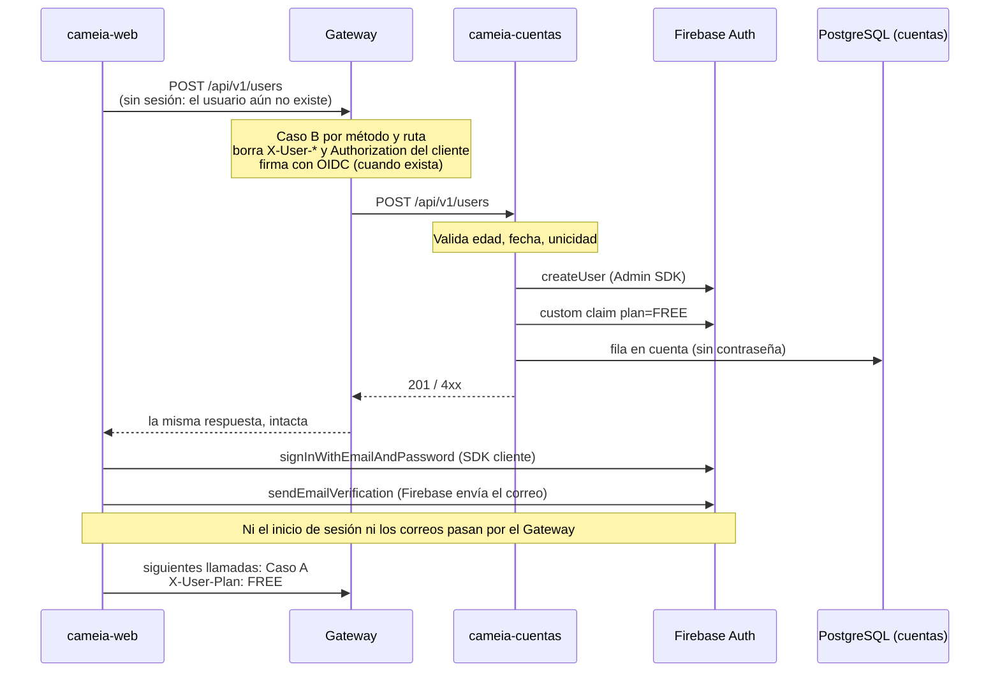

# Spec — CM-14-Registro-usuario: lo que el Gateway necesita para el registro de usuarios

- **HU asociada:** CM-14 — Registro de usuario
- **Sprint:** 1
- **Fecha:** 15/09/2026 · **Actualizado:** 15/09/2026, con las respuestas de Juan Vela a la Fase 2
- **Estado:** borrador — Fase 2 **cerrada** para el Gateway (15/09/2026). Sigue abierto `GW-TBD-17`
  solo en la ruta exacta de verificación de correo, y no bloquea ningún bloque de tareas
- **Flujo SDD:** Fase 1 — Requisitos EARS, con la Fase 2 en cierre (§5)
- **Rama:** `CM-14-registro-usuario` → `develop` (kebab-case en minúsculas, `CONTRIBUTING.md`)
- **Alcance:** **solo el Gateway**. La lógica de registro, las validaciones, el almacenamiento y los
  correos son de cameia-cuentas o del frontend, y se citan aquí solo para explicar lo que el Gateway
  debe dejar pasar
- **Fuentes:**
  descripción de la HU entregada por Juan Vela el 15/09/2026 (prototipo PRT-01.01 — Registro / Modal de Confirmación),
  `AGENTS.md` §1, §2, §5, §6 y §7,
  `specs/CM-104-correcciones-OIDC/spec.md` (firma saliente, de la que este spec depende),
  `specs/CM-113-integracion-perfil/` (decisión de dejar fuera el rate limit del Gateway).
  Documentación consultada el 15/09/2026:
  [Firebase — Manage users (Admin)](https://firebase.google.com/docs/auth/admin/manage-users),
  [Firebase — Email action links](https://firebase.google.com/docs/auth/admin/email-action-links),
  [Firebase — Manage users (web)](https://firebase.google.com/docs/auth/web/manage-users),
  [Firebase — Auth limits](https://firebase.google.com/docs/auth/limits),
  [Identity Platform — accounts.signUp](https://docs.cloud.google.com/identity-platform/docs/reference/rest/v1/accounts/signUp),
  [Cloud Run — Container runtime contract](https://docs.cloud.google.com/run/docs/container-contract),
  [Cloud Armor — Rate limiting overview](https://docs.cloud.google.com/armor/docs/rate-limiting-overview),
  [Spring Cloud Gateway — HttpHeadersFilters](https://docs.spring.io/spring-cloud-gateway/reference/spring-cloud-gateway-server-webflux/httpheadersfilters.html).

---

## 1. Contexto

### 1.1 Lo que pide la HU

Crear una cuenta con correo y contraseña. Cuentas valida (unicidad del correo vía Firebase, edad
≥ 18 calculada en UTC, fecha de nacimiento no futura y edad no superior a 110 años), guarda las
credenciales en Firebase Auth y los datos de la cuenta en PostgreSQL (`estado='pending_verification'`,
`correo_verificado=false`), y asigna el **Plan Gratis** (`FREE`) de inmediato, visible para el usuario
en el modal de confirmación.

El registro lo hace **cameia-cuentas** porque es quien escribe los custom claims del plan
(`AGENTS.md` §6.4: `X-User-Plan` sale del claim `plan`, que escribe Cuentas). **Decidido el
15/09/2026** (`GW-TBD-15`).

### 1.2 El flujo



La recuperación de contraseña (`sendPasswordResetEmail`) también va del navegador a Firebase, sin
pasar por el Gateway (C-6).

### 1.3 Qué le toca al Gateway y qué no

| Le toca al Gateway | No le toca al Gateway |
|---|---|
| Declarar `POST /api/v1/users` como Caso B, **por método y ruta** | Validar edad, fecha de nacimiento o unicidad (`AGENTS.md` §1 y §7.1) |
| Que ningún `X-User-*` ni `Authorization` del cliente llegue a Cuentas | Crear el usuario en Firebase o escribir custom claims |
| No registrar en logs el cuerpo de la petición: lleva la contraseña | Esquema de la tabla `cuenta` |
| Dejar pasar intactas las respuestas de error de Cuentas | Correos de verificación y de recuperación de contraseña |
| Firmar la llamada con OIDC cuando exista ese paso | El modal PRT-01.01 |
| **Prioridad:** exponer los health v1 de cada microservicio **solo en desarrollo** | Rate limit: se hace en GCP, delante del Gateway (C-4) |

---

## 2. Crítica del planteamiento — decisiones finales

Resultado de la Fase 2 (15/09/2026). Cada fila es la decisión con la que se diseña; el origen de
cada una está en §5.

| # | Tema | Decisión |
|---|---|---|
| C-1 | Quién crea el usuario | **Cuentas**, con Admin SDK `createUser`. `POST /api/v1/users` es Caso B. Se aceptan como consecuencias C-3 y C-4 (`GW-TBD-15`) |
| C-2 | Ruta pública comparada solo por texto | Las rutas públicas se comparan por **método + ruta exactos** (`REQ-REG-06`) |
| C-3 | Contraseña en tránsito por el Gateway | El Gateway **nunca registra el cuerpo** del registro. Wiretap apagado y probado (`REQ-REG-08`) |
| C-4 | Abuso y rate limit | **Rate limit en GCP**, delante del Gateway. El Gateway **no propaga la IP** del cliente: el Admin SDK no tiene límite por IP ni admite la IP del usuario. DevOps define balanceador + Cloud Armor, ingress restringido y clave del límite (`GW-TBD-18`) |
| C-5 | Enumeración de correos | Cuentas responde **`409`** con un mensaje que indica que ya existe un usuario con ese correo. Se acepta que eso revela si un correo está registrado. El Gateway lo deja pasar intacto (`REQ-REG-09`, `GW-TBD-21`) |
| C-6 | Correo de verificación y recuperación de contraseña | Los **envía Firebase**, disparados desde el frontend: `sendEmailVerification` justo después del registro y `sendPasswordResetEmail`. Sin SMTP propio. El correo verificado lo **exige el servidor** con el claim `email_verified` del token, nunca el navegador. Sin correo verificado el usuario **no puede hacer nada** salvo usar la ruta de verificación de correo, cuya ruta exacta está pendiente (`GW-TBD-16`, `GW-TBD-17`) |
| C-7 | Perfil de desarrollo activo en despliegue | Se **quita `local` por defecto** de `application.yml`, y el arranque falla si la lista de desarrollo está activa con `K_SERVICE` definida (`GW-TBD-19`) |
| C-8 | Health v1 de cada microservicio | Todos siguen **`/api/v1/<prefijo>/health`**. Entrevista alinea su `/health` actual (`GW-TBD-20`) |
| C-9 | Health abierto sin spec en la copia de trabajo | `"/api/v1/users/health"` **sale de la lista base** y pasa a la de desarrollo (T-01) |
| C-10 | Prefijo público para Cuentas | **No.** Método + ruta exactos en Java, sin prefijo público y sin ruta YAML propia para el registro: `Path=/api/v1/users/**` ya lo cubre (`GW-TBD-23`) |

---

## 3. Requisitos funcionales — notación EARS

Numeración propia: `REQ-REG-NN`.

### 3.1 PRIORIDAD — Health de los microservicios, solo en desarrollo

#### REQ-REG-01 — Health v1 público en desarrollo

```
Mientras el sistema corre con el perfil de desarrollo,
el sistema debe reenviar sin exigir ID Token de Firebase
las solicitudes GET a los endpoints de health v1 de la lista de desarrollo.
```

Lista de desarrollo (C-8):

| Método | Ruta |
|---|---|
| `GET` | `/api/v1/users/health` |
| `GET` | `/api/v1/profiles/health` |
| `GET` | `/api/v1/interviews/health` |
| `GET` | `/api/v1/voice-service/health` |
| `GET` | `/api/v1/audit/health` |

> Sirve para comprobar, sin iniciar sesión, que el Gateway alcanza a cada microservicio. Solo
> versión 1: una versión nueva de un health no se abre sola.

#### REQ-REG-02 — Nunca en despliegue

```
Mientras el sistema corre sin el perfil de desarrollo,
el sistema debe tratar los endpoints de la lista de desarrollo como Caso A.
```

```
Si el sistema arranca con la lista de desarrollo activa y la variable `K_SERVICE` está definida,
entonces el sistema debe fallar el arranque.
```

```
El sistema no debe permitir que una variable de entorno ni una propiedad externa
agregue rutas a la lista de desarrollo ni a la lista base.
```

```
Cuando no se define `SPRING_PROFILES_ACTIVE`,
el sistema no debe activar el perfil de desarrollo.
```

> Misma asimetría que `REQ-OIDC-07`: cómodo en local, imposible de reproducir en despliegue por
> configuración. Abrir una ruta sigue exigiendo recompilar (`AGENTS.md` §5).

#### REQ-REG-03 — Texto exacto y método exacto

```
Cuando llega una solicitud cuya ruta no coincide carácter a carácter
o cuyo método no es GET con una entrada de la lista de desarrollo,
el sistema debe tratarla como Caso A.
```

> `/api/v1/users/health/extra`, `/api/v1/users/health/` y `POST /api/v1/users/health` siguen
> exigiendo token.

#### REQ-REG-04 — Mismo saneamiento que cualquier Caso B

```
Cuando el sistema reenvía una solicitud de la lista de desarrollo,
el sistema debe eliminar los `X-User-*` del cliente y debe propagar `X-Request-Id`.
```

### 3.2 Registro de usuario

#### REQ-REG-05 — El registro es Caso B

```
Cuando llega una solicitud POST a `/api/v1/users`,
el sistema debe reenviarla a cameia-cuentas sin exigir ID Token de Firebase.
```

#### REQ-REG-06 — Las rutas públicas se definen por método y ruta

```
El sistema debe decidir si una solicitud es Caso B comparando su método HTTP y su ruta exacta
con las entradas públicas, y no solo su ruta.
```

```
Cuando llega a `/api/v1/users` una solicitud con un método distinto de POST,
el sistema debe tratarla como Caso A.
```

#### REQ-REG-07 — Ninguna credencial del cliente llega a Cuentas

```
Cuando el sistema reenvía `POST /api/v1/users`,
el sistema debe eliminar los `X-User-*` enviados por el cliente
y no debe reenviar la cabecera `Authorization` recibida del cliente.
```

> Con la firma OIDC activa, `REQ-OIDC-03` ya reemplaza `Authorization`. Este requisito cubre el
> perfil local, donde la firma está apagada: un ID Token que el navegador envíe por inercia no debe
> llegar a Cuentas (`AGENTS.md` §7, bloqueante 4).

#### REQ-REG-08 — El cuerpo no se registra

```
El sistema nunca debe escribir en el log el cuerpo de la solicitud
ni el de la respuesta de `POST /api/v1/users`, en ningún perfil.
```

#### REQ-REG-09 — Las respuestas de Cuentas pasan intactas

```
Cuando cameia-cuentas responde a `POST /api/v1/users` con un estado 2xx o 4xx,
el sistema debe devolver al cliente el mismo estado y el mismo cuerpo.
```

```
El sistema no debe validar la edad, la fecha de nacimiento, el formato del correo
ni la unicidad del correo.
```

> El catálogo de errores del Gateway es para fallos del Gateway. Un `409` o `422` de Cuentas lleva
> el mensaje que el modal necesita; reemplazarlo por un error genérico rompería PRT-01.01.

#### REQ-REG-10 — El registro también va firmado

```
Mientras el paso de firma OIDC está activo,
el sistema debe firmar `POST /api/v1/users` como cualquier otra ruta saliente.
```

> Consecuencia de `REQ-OIDC-01`. Se escribe para que la prueba de contrato de OIDC incluya esta ruta.

---

## 4. Requisitos no funcionales

### REQ-NF-REG-01 — La suite corre sin credenciales

```
Cuando se ejecuta `docker compose run --rm verify`,
el sistema debe compilar y ejecutar las pruebas de este spec
sin credenciales de Firebase ni de Google.
```

### REQ-NF-REG-02 — Sin paquetes nuevos ni dependencias cruzadas

```
El sistema debe implementar este spec dentro de los paquetes existentes,
sin que `filter` importe `config` ni `exception`.
```

---

## 5. Clarificaciones (Fase 2)

Continúa la serie `GW-TBD` desde `GW-TBD-15`.

> El registro de todos los `GW-TBD` y del siguiente número libre está en `specs/NUMERACIONES.md`.

| ID | Pregunta | Estado | Respuesta / recomendación | Quién decide |
|---|---|---|---|---|
| `GW-TBD-15` | ¿Quién crea el usuario en Firebase? (C-1) | ✅ Cerrado 15/09/2026 | **Cuentas**, con Admin SDK. Caso B | Juan Vela |
| `GW-TBD-16` | ¿Cómo se envían el correo de verificación y el de recuperación? (C-6) | ✅ Cerrado 15/09/2026 | **Firebase**, disparado desde el frontend (`sendEmailVerification` tras iniciar sesión; `sendPasswordResetEmail`). Sin SMTP propio. Sin impacto en el Gateway | Juan Vela |
| `GW-TBD-17` | ¿Qué puede hacer un usuario con `email_verified=false`? | 🟡 Parcial · la **ruta exacta quedó cerrada el 17/09/2026** (`POST /api/v1/users/me/verification`, contrato de cameia-cuentas; se implementa en `specs/CM-14-verificacion-correo/`). Sigue abierto si el Gateway bloquea el resto, **no bloquea** | **Decidido:** nada, salvo la ruta de verificación de correo. **Pendiente para una sesión futura:** la ruta exacta y el requisito del Gateway, que es autorización (`AGENTS.md` §6.1 paso 3) y afecta a **todas** las rutas de Caso A y a las pruebas existentes. Aclarar también qué hace esa ruta: abrir el enlace del correo va del navegador a Firebase y no pasa por el Gateway | Juan Vela |
| `GW-TBD-18` | ¿Cómo se protege el registro contra abuso? (C-4) | ✅ Cerrado para el Gateway 15/09/2026 · abierto para DevOps | **Rate limit en GCP.** El Admin SDK no está limitado y no admite IP: el Gateway no propaga la IP. DevOps confirma balanceador + Cloud Armor, ingress y clave del límite | Juan Vela · DevOps |
| `GW-TBD-19` | ¿Cómo se evita que el perfil de desarrollo quede activo en despliegue? (C-7) | ✅ Cerrado 15/09/2026 | Quitar el default `local` de `application.yml` + guardia con `K_SERVICE` | Juan Vela |
| `GW-TBD-20` | Inventario de health v1 (C-8) | ✅ Cerrado 15/09/2026 | Todos siguen `/api/v1/<prefijo>/health`. Aviso a Entrevista: hoy expone `/health` | Juan Vela |
| `GW-TBD-21` | ¿Qué responde Cuentas ante un correo ya registrado? (C-5) | ✅ Cerrado 15/09/2026 | **`409`** con un mensaje que indica que ya existe un usuario con ese correo. El Gateway lo deja pasar intacto (`REQ-REG-09`) | Juan Vela |
| `GW-TBD-22` | ¿El ID de la HU es CM-14 o CM-114? | ✅ Cerrado 15/09/2026 | **CM-14**, sprint 1. La carpeta conserva su nombre; la rama es `CM-14-registro-usuario` | Juan Vela |
| `GW-TBD-23` | ¿Prefijo público completo para Cuentas, o método + ruta exactos? (C-10) | ✅ Cerrado 15/09/2026 | **Método + ruta exactos** en Java, sin prefijo público y sin ruta YAML propia para el registro | Juan Vela |

---

## 6. Fuera de alcance

| Tema | Por qué |
|---|---|
| Validaciones de edad, fecha, formato y unicidad | Lógica de dominio: prohibida en el Gateway (`AGENTS.md` §7.1) |
| Creación en Firebase, custom claims, tabla `cuenta` | cameia-cuentas |
| Correos de verificación y recuperación | Frontend + Firebase (C-6) |
| Rate limit | GCP, delante del Gateway (C-4) |
| Propagar la IP del cliente | No hace falta para Firebase (C-4). Entra con requisito propio si Cuentas la necesita |
| Versionado `v2` de rutas | Sin HU que lo pida |
| Firma OIDC | `specs/CM-104-correcciones-OIDC/`. **Actualizado 17/09/2026 (Fase 7):** por decisión de Juan Vela viaja en el mismo PR que esta HU, porque `REQ-REG-10` (el registro firmado) y la guardia `local` + `prod` del plan §3.3 no se podían cerrar sin ella. Sus requisitos siguen en su propio spec |

---

## 7. Criterio de terminado (DoD)

Bloque prioritario (health en desarrollo):

- [x] Con el perfil de desarrollo, `GET` a cada health de la lista llega al microservicio sin token y sin `X-User-*` del cliente (prueba de contrato) — `DevHealthRoutesTest.devHealth_withLocalProfile_reachesDownstreamWithoutToken` (5 rutas)
- [x] Sin el perfil de desarrollo, el mismo `GET` responde `401` y el microservicio no recibe nada (prueba) — `FirebaseAuthGlobalFilterTest.devHealth_withoutLocalProfile_returns401`
- [x] `POST` al health y variantes de ruta (`/health/`, `/health/x`) responden `401` con el perfil activo (prueba) — `devHealth_postMethod_returns401`, `devHealth_trailingSlashOrSubpath_returns401`
- [x] El arranque falla con la lista de desarrollo activa y `K_SERVICE` definida (prueba) — `GatewayStartupTest.devRoutes_onCloudRun_failsStartup`; además `devRoutes_withProdProfile_failsStartup`
- [x] `application.yml` ya no activa `local` por defecto — `VersionedYamlTest.applicationYaml_hasNoDefaultLocalProfile`; comprobado sin la variable: `No active profile set`
- [x] `"/api/v1/users/health"` ya no está en la lista base — `PUBLIC_ROUTES` solo tiene `POST /webhooks/wompi` y `POST /api/v1/users`

Registro:

- [x] `POST /api/v1/users` sin token llega a Cuentas, sin `X-User-*` ni `Authorization` del cliente (prueba de contrato) — `registration_withoutToken_reachesAccountsWithoutClientCredentials`
- [x] `GET`, `PUT`, `PATCH` y `DELETE /api/v1/users` sin token responden `401` (prueba) — `usersRoot_nonPostWithoutToken_returns401` (4 métodos)
- [x] Un `409` y un `422` de Cuentas llegan al cliente con estado y cuerpo intactos (prueba) — `registration_downstreamError_isReturnedUnchanged`
- [x] El wiretap de Reactor Netty está apagado en todos los perfiles versionados (prueba) — `VersionedYamlTest.versionedYaml_doesNotEnableWiretap`
- [x] `POST /webhooks/wompi` sigue funcionando igual (la prueba existente no se toca) — `git diff origin/develop...HEAD` no cambia ni borra líneas de esa prueba

Siempre:

- [x] `docker compose run --rm verify` en verde, sin credenciales — `docker compose run --rm verify` 17/09/2026: `Tests run: 62, Failures: 0`, `BUILD SUCCESS`; `mvn clean compile test-compile -Xlint:all` sin advertencias
- [x] `AGENTS.md` §4, §5 y §6.2, y `docs/COMO-FUNCIONA.md`, reflejan las listas y el emparejamiento por método — actualizados el 16/09/2026
- [ ] Avisos enviados: DevOps (C-4), Entrevista (C-8), Cuentas y frontend (C-6)
- [x] Ningún secreto real en el diff — revisado sobre `git diff origin/develop...HEAD` el 17/09/2026
- [x] Bitácora IA rellenada el mismo día (`AGENTS.md` §10) — `Entregables/16092026_BitacoraIA_Codigo_E2.md` y `17092026_BitacoraIA_Codigo_E2.md`
- [ ] Título del PR: `CM-14 | feat(gateway): registro de usuario con rutas públicas por método y firma OIDC saliente [IA-ASISTIDO]` — *cambiado el 17/09/2026: el PR incluye `specs/CM-104-correcciones-OIDC/` (ver §6)*
